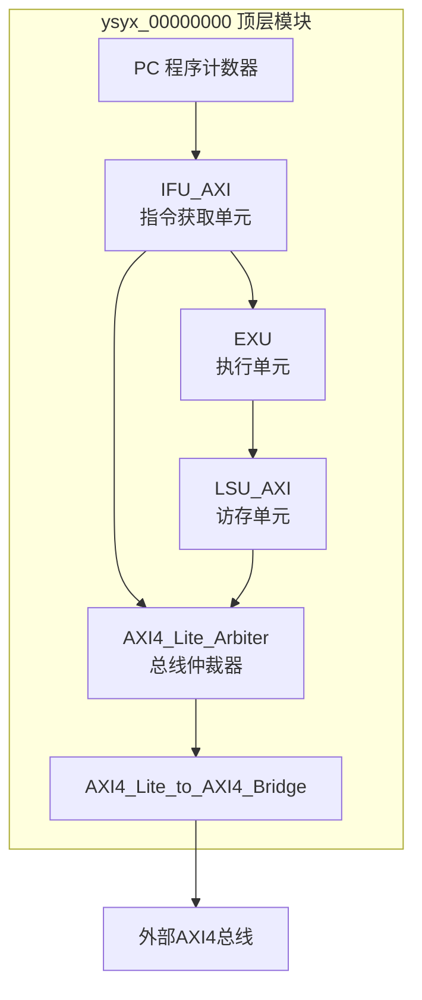
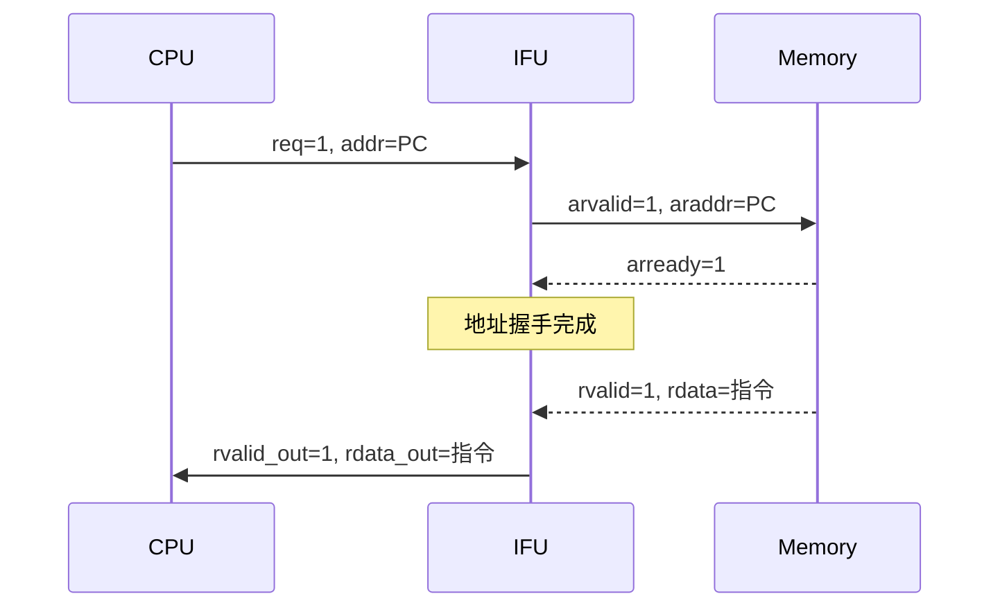
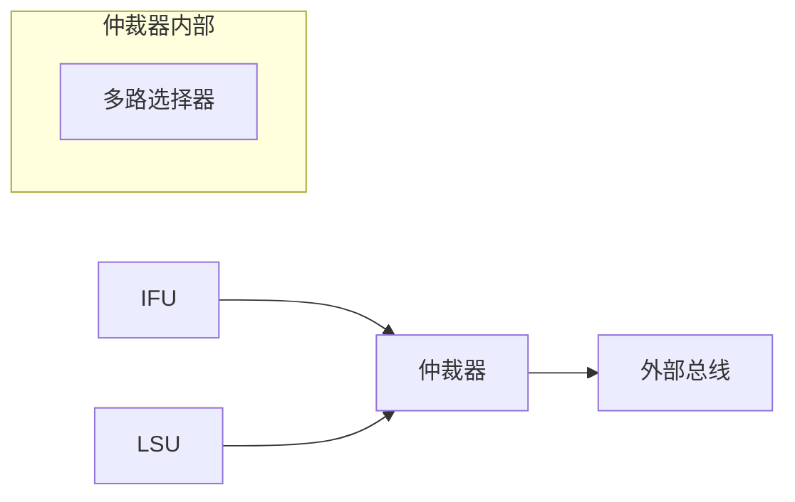
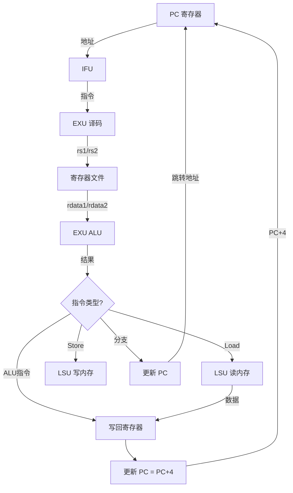
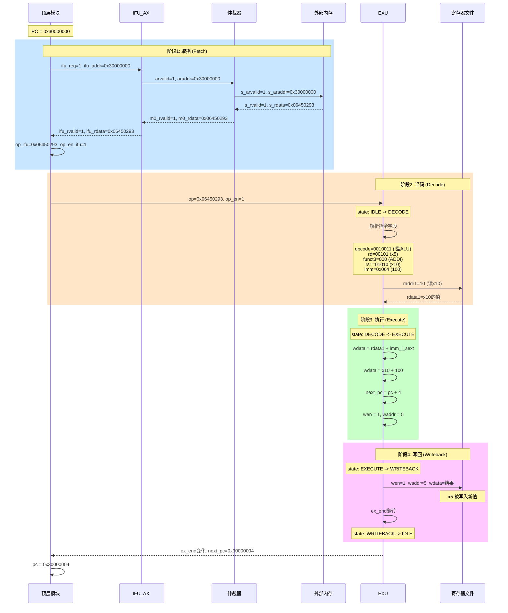
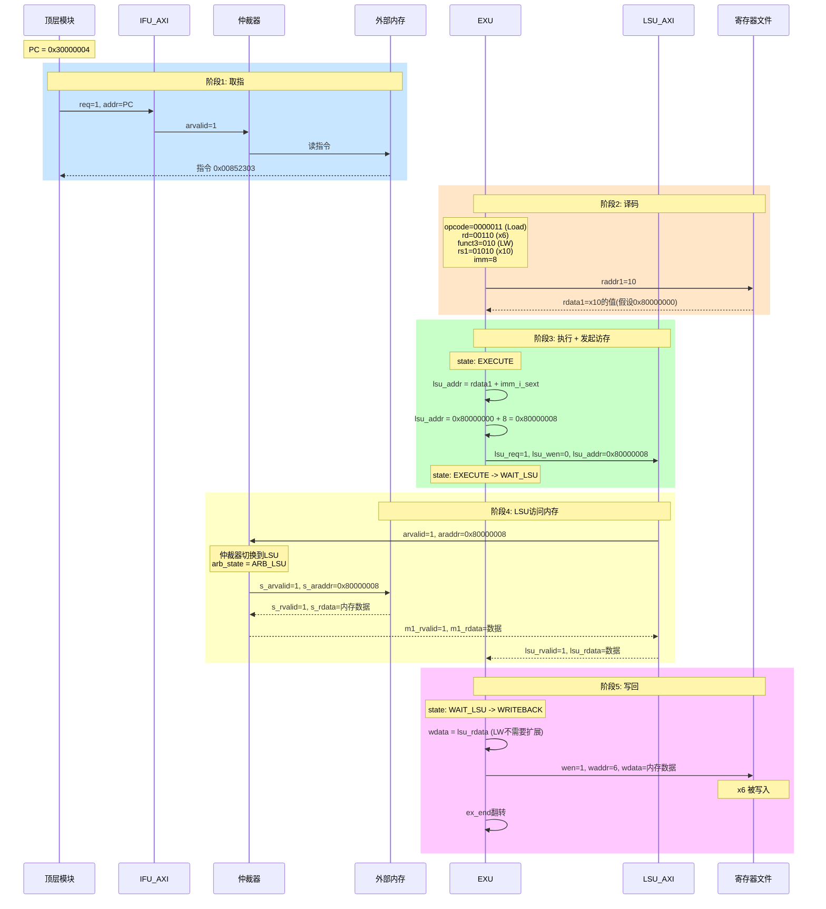
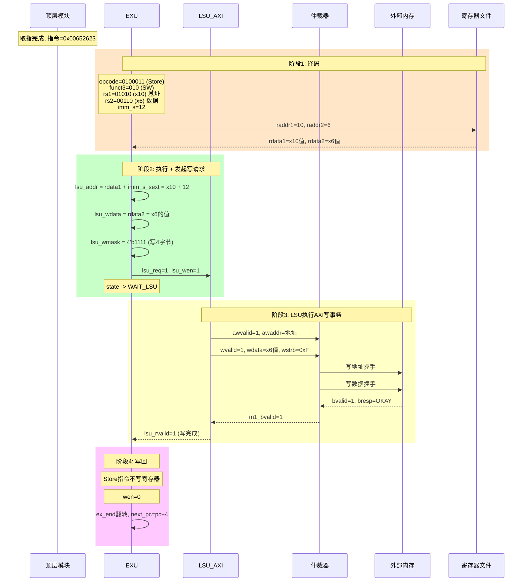
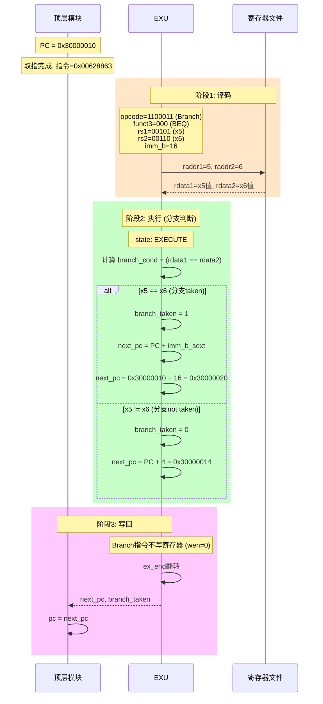

# NPC 处理器代码讲义

> 本讲义面向了解 Verilog 语法但不熟悉 Chisel 的初学者，帮助理解 NPC (RISC-V 处理器) 的代码结构和执行流程。

## 一、项目概述

NPC (New Processor Core) 是一个基于 RISC-V 指令集的简单处理器核心实现。代码使用 **Verilog** 编写，采用模块化设计。

### 关键文件位置

| 模块 | 文件路径 |
|------|----------|
| 顶层模块 | `npc/vsrc/ysyx_00000000.v` |
| 执行单元 | `npc/vsrc/core/EXU.v` |
| 指令获取单元 | `npc/vsrc/core/IFU_AXI.v` |
| 访存单元 | `npc/vsrc/core/LSU_AXI.v` |
| 寄存器文件 | `npc/vsrc/core/RegisterFile.v` |
| 总线仲裁器 | `npc/vsrc/core/AXI4_Lite_Arbiter.v` |

---

## 二、整体架构



### 处理器执行流程

1. **取指 (Fetch)**: IFU 根据 PC 从内存读取指令
2. **译码 (Decode)**: EXU 解析指令的 opcode、funct3、funct7、寄存器地址、立即数
3. **执行 (Execute)**: EXU 执行 ALU 运算或分支判断
4. **访存 (Memory)**: 如果是 Load/Store 指令，通过 LSU 访问内存
5. **写回 (Writeback)**: 将结果写回寄存器文件

---

## 三、顶层模块详解 (ysyx_00000000.v)

### 3.1 模块接口

```verilog
module ysyx_00000000 (
    input         clock,          // 时钟信号
    input         reset,          // 复位信号
    input         io_interrupt,   // 中断信号
    // AXI4 Master 接口 (连接外部存储)
    output        io_master_awvalid,  // 写地址有效
    output [31:0] io_master_awaddr,   // 写地址
    // ... 其他 AXI4 信号 ...
);
```

### 3.2 核心信号定义

```verilog
// PC 相关
reg [31:0] pc;              // 当前程序计数器
wire [31:0] next_pc;        // 下一条指令地址

// 指令相关
wire ifu_rvalid;            // IFU 数据有效
wire [31:0] ifu_rdata;      // 从内存读取的指令
reg [31:0] op_ifu;          // 送入 EXU 的指令
reg op_en_ifu;              // 指令有效使能

// 执行相关
wire ex_end;                // 执行完成信号
wire branch_taken;          // 分支是否跳转
```

### 3.3 模块实例化关系

```verilog
// 1. 执行单元
EXU EXU (
    .op(op_ifu),            // 输入: 指令
    .pc(pc),                // 输入: 当前PC
    .ex_end(ex_end),        // 输出: 执行完成
    .next_pc(next_pc),      // 输出: 下一PC
    .lsu_req(lsu_req),      // 输出: LSU请求
    ...
);

// 2. 指令获取单元
IFU_AXI u_ifu (
    .req(ifu_req),          // 输入: 取指请求
    .addr(ifu_addr),        // 输入: 取指地址
    .rvalid_out(ifu_rvalid),// 输出: 数据有效
    .rdata_out(ifu_rdata),  // 输出: 指令数据
    // AXI 接口连接到仲裁器
    ...
);

// 3. 访存单元
LSU_AXI u_lsu (
    .req(lsu_req),          // 输入: 访存请求
    .wen(lsu_wen),          // 输入: 写使能
    .addr(lsu_addr),        // 输入: 访存地址
    ...
);

// 4. 总线仲裁器 (IFU 和 LSU 共享一个总线)
AXI4_Lite_Arbiter u_arbiter (
    // Master 0: IFU
    .m0_araddr(ifu_araddr), ...
    // Master 1: LSU  
    .m1_araddr(lsu_araddr), ...
    // Slave: 输出到桥接器
    .s_araddr(arb_araddr), ...
);
```

### 3.4 控制逻辑状态机

```verilog
always @(posedge clk or posedge rst) begin
    if (rst) begin
        pc <= 32'h3000_0000;  // 复位后从 Flash 起始地址开始
        ifu_req <= 1'b0;
        first_fetch_pending <= 1'b1;
    end else begin
        // 1. 检测执行完成
        if (ex_end != ex_end_prev) begin
            rdop_en_reg <= 1'b1;  // 准备取下一条指令
        end
        
        // 2. 更新 PC
        if (update_pc) begin
            pc <= next_pc;  // next_pc 可能是 PC+4 或分支目标
        end
        
        // 3. 发起取指请求
        if (first_fetch_pending || update_pc) begin
            ifu_req <= 1'b1;
        end
        
        // 4. 指令就绪，送入 EXU
        if (ifu_rvalid) begin
            op_ifu <= ifu_rdata;
            op_en_ifu <= 1'b1;
        end
    end
end
```

---

## 四、执行单元详解 (EXU.v)

EXU 是处理器的核心，包含了译码、ALU、分支判断、CSR 等功能。

### 4.1 状态机定义

```verilog
parameter IDLE      = 3'b000;  // 空闲，等待指令
parameter DECODE    = 3'b001;  // 译码阶段
parameter EXECUTE   = 3'b010;  // 执行阶段
parameter WAIT_LSU  = 3'b100;  // 等待 LSU 完成
parameter WRITEBACK = 3'b101;  // 写回阶段
```

### 4.2 RISC-V 指令格式解析

```verilog
// 从 32 位指令中提取各字段
wire [6:0] opcode = op[6:0];      // 操作码 (决定指令类型)
wire [2:0] funct3 = op[14:12];    // 功能码3 (区分同类指令)
wire [6:0] funct7 = op[31:25];    // 功能码7 (如 ADD/SUB)
wire [4:0] rd  = op[11:7];        // 目标寄存器
wire [4:0] rs1 = op[19:15];       // 源寄存器1
wire [4:0] rs2 = op[24:20];       // 源寄存器2
```

### 4.3 立即数扩展

```verilog
// I 型立即数 (用于 ADDI, LW 等)
wire [11:0] imm_i = op[31:20];
wire [31:0] imm_i_sext = {{20{imm_i[11]}}, imm_i};  // 符号扩展

// S 型立即数 (用于 SW 等)
wire [11:0] imm_s = {op[31:25], op[11:7]};
wire [31:0] imm_s_sext = {{20{imm_s[11]}}, imm_s};

// B 型立即数 (用于分支指令)
wire [12:0] imm_b = {op[31], op[7], op[30:25], op[11:8], 1'b0};
wire [31:0] imm_b_sext = {{19{imm_b[12]}}, imm_b};

// U 型立即数 (用于 LUI, AUIPC)
wire [31:0] imm_u = {op[31:12], 12'b0};

// J 型立即数 (用于 JAL)
wire [20:0] imm_j = {op[31], op[19:12], op[20], op[30:21], 1'b0};
wire [31:0] imm_j_sext = {{11{imm_j[20]}}, imm_j};
```

### 4.4 指令执行示例

**R 型指令 (寄存器-寄存器运算)**:

```verilog
7'b0110011: begin  // R-type opcode
    case ({funct7, funct3})
        10'b0000000_000: wdata <= rdata1 + rdata2;  // ADD
        10'b0100000_000: wdata <= rdata1 - rdata2;  // SUB
        10'b0000000_001: wdata <= rdata1 << rdata2[4:0];  // SLL
        10'b0000000_100: wdata <= rdata1 ^ rdata2;  // XOR
        ...
    endcase
    next_pc <= pc + 4;
    state <= WRITEBACK;
end
```

**分支指令**:

```verilog
7'b1100011: begin  // Branch opcode
    // 组合逻辑计算分支条件
    wire branch_cond = (funct3 == 3'b000) ? (rdata1 == rdata2) :  // BEQ
                       (funct3 == 3'b001) ? (rdata1 != rdata2) :  // BNE
                       (funct3 == 3'b100) ? ($signed(rdata1) < $signed(rdata2)) : // BLT
                       ...
    
    branch_taken <= branch_cond;
    next_pc <= branch_cond ? (pc + imm_b_sext) : (pc + 4);
    state <= WRITEBACK;
end
```

**Load 指令**:

```verilog
7'b0000011: begin  // Load opcode
    lsu_addr <= rdata1 + imm_i_sext;  // 基址 + 偏移
    lsu_req <= 1;
    lsu_wen <= 0;  // 读操作
    state <= WAIT_LSU;  // 等待 LSU 返回数据
end

// 在 WAIT_LSU 状态等待数据
WAIT_LSU: begin
    if (lsu_rvalid) begin
        case (funct3)
            3'b000: wdata <= {{24{lsu_rdata[7]}}, lsu_rdata[7:0]};  // LB
            3'b001: wdata <= {{16{lsu_rdata[15]}}, lsu_rdata[15:0]}; // LH
            3'b010: wdata <= lsu_rdata;  // LW
            ...
        endcase
        state <= WRITEBACK;
    end
end
```

---

## 五、寄存器文件 (RegisterFile.v)

### 5.1 基本结构

```verilog
module RegisterFile #(
    parameter ADDR_WIDTH = 5,   // 5位地址 = 32个寄存器
    parameter DATA_WIDTH = 32   // 32位数据
)(
    input clk, rst,
    // 写端口
    input [DATA_WIDTH-1:0] wdata,
    input [ADDR_WIDTH-1:0] waddr,
    input wen,
    // 读端口1
    input [ADDR_WIDTH-1:0] raddr1,
    output [DATA_WIDTH-1:0] rdata1,
    // 读端口2
    input [ADDR_WIDTH-1:0] raddr2,
    output [DATA_WIDTH-1:0] rdata2
);
    // 32 个 32 位寄存器
    reg [DATA_WIDTH-1:0] rf [2**ADDR_WIDTH-1:0];
```

### 5.2 关键特性

- **x0 硬连线为 0**: 读 x0 永远返回 0，写 x0 无效
- **2 读 1 写**: 支持同时读两个寄存器、写一个寄存器
- **写优先**: 同地址读写时，读取的是旧值（下周期才能读到新值）

```verilog
// x0 特殊处理
assign rdata1 = (raddr1 == 0) ? 0 : rf[raddr1];
assign rdata2 = (raddr2 == 0) ? 0 : rf[raddr2];

// 写操作 (不能写 x0)
if (wen && waddr != 0) begin
    rf[waddr] <= wdata;
end
```

---

## 六、IFU 指令获取单元 (IFU_AXI.v)

IFU 负责从内存获取指令，使用 AXI4-Lite 协议。

### 6.1 状态机

```verilog
localparam IFU_IDLE    = 2'd0;  // 空闲
localparam IFU_WAIT_AR = 2'd1;  // 等待地址握手
localparam IFU_WAIT_R  = 2'd2;  // 等待数据响应

// 状态转换
IFU_IDLE: 收到 req -> IFU_WAIT_AR
IFU_WAIT_AR: arready=1 -> IFU_WAIT_R  
IFU_WAIT_R: rvalid=1 -> IFU_IDLE (输出 rvalid_out)
```

### 6.2 AXI4-Lite 读事务流程



---

## 七、LSU 访存单元 (LSU_AXI.v)

LSU 处理 Load/Store 指令的内存访问。

### 7.1 读写操作

```verilog
// 读操作 (Load)
if (req && !wen) begin
    araddr <= addr;
    arvalid <= 1;
    rready <= 1;
end

// 写操作 (Store)  
if (req && wen) begin
    awaddr <= addr;
    awvalid <= 1;
    wdata_axi <= wdata;
    wstrb <= wmask;  // 字节掩码
    wvalid <= 1;
    bready <= 1;
end
```

### 7.2 字节掩码 (wmask)

```verilog
// SB (Store Byte): 只写 1 字节
case (addr[1:0])
    2'b00: wmask = 4'b0001;  // 写字节 0
    2'b01: wmask = 4'b0010;  // 写字节 1
    2'b10: wmask = 4'b0100;  // 写字节 2
    2'b11: wmask = 4'b1000;  // 写字节 3
endcase

// SH (Store Half): 写 2 字节
// SW (Store Word): wmask = 4'b1111
```

---

## 八、总线仲裁器 (AXI4_Lite_Arbiter.v)

由于 IFU 和 LSU 共享同一个内存总线，需要仲裁器协调。

### 8.1 仲裁策略

```verilog
// IFU 优先策略
if (ifu_req && lsu_req) begin
    arb_state_next = ARB_IFU;  // IFU 优先
end else if (ifu_req) begin
    arb_state_next = ARB_IFU;
end else if (lsu_req) begin
    arb_state_next = ARB_LSU;
end
```

### 8.2 信号切换



当 IFU 获得总线时：
- IFU 的信号直接连接到外部总线
- LSU 的 ready 信号全部置 0（阻塞）

---

## 九、数据流图



---

## 十、常见问题解答

**Q1: 为什么 ex_end 用翻转而不是脉冲？**

```verilog
ex_end <= ~ex_end;  // 每次执行完翻转
```

顶层检测变化：`if (ex_end != ex_end_prev)`，这样无论是 0->1 还是 1->0 都能检测到执行完成。

**Q2: 为什么要有仲裁器？**

因为 RISC-V 的 Load/Store 架构中，取指和访存可能同时发生（虽然本设计是串行的），共享总线需要仲裁防止冲突。

**Q3: AXI4-Lite 和 AXI4 的区别？**

- AXI4-Lite: 简化版，每次传输 1 个数据
- AXI4: 完整版，支持突发传输 (burst)
- 本设计内部用 AXI4-Lite，通过 Bridge 转换为 AXI4 接口对外

---

## 十一、指令执行流程详解（重点）

下面通过 4 个典型指令，详细展示它们在 NPC 中经过的模块和信号变化。

### 11.1 示例 1: ADDI 指令（I型算术指令）

**指令**: `addi x5, x10, 100`

**含义**: x5 = x10 + 100

**编码**: `0x06450293`



**周期统计**:

- 取指: 约 2-10 周期 (取决于内存延迟)
- 译码: 1 周期
- 执行: 1 周期
- 写回: 1 周期

**涉及的模块和关键信号**:

| 阶段 | 模块 | 关键信号 | 文件位置 |
|------|------|----------|----------|
| 取指 | 顶层 | `ifu_req`, `ifu_addr` | ysyx_00000000.v:477-484 |
| 取指 | IFU | `arvalid`, `araddr`, `rvalid`, `rdata` | IFU_AXI.v:96-132 |
| 取指 | 仲裁器 | `m0_arvalid`, `s_arvalid` | AXI4_Lite_Arbiter.v:191-213 |
| 译码 | EXU | `opcode`, `rd`, `rs1`, `imm_i` | EXU.v:81-99 |
| 执行 | EXU | `wdata <= rdata1 + imm_i_sext` | EXU.v:279 |
| 写回 | 寄存器文件 | `wen`, `waddr`, `wdata` | RegisterFile.v:25-37 |

---

### 11.2 示例 2: LW 指令（Load 指令）

**指令**: `lw x6, 8(x10)`

**含义**: x6 = Memory[x10 + 8]

**编码**: `0x00852303`



**关键代码路径**:

```verilog
// EXU.v: EXECUTE阶段处理Load指令
7'b0000011: begin  // Load opcode
    lsu_addr <= rdata1 + imm_i_sext;  // 计算地址: x10 + 8
    lsu_req <= 1;                      // 发起LSU请求
    lsu_wen <= 0;                      // 读操作
    waddr <= rd[4:0];                  // 准备写回rd
    wen <= 1;
    case (funct3)
        3'b010: lsu_wmask <= 4'b1111;  // LW: 读4字节
    endcase
    state <= WAIT_LSU;  // 进入等待状态
end

// EXU.v: WAIT_LSU阶段等待数据
WAIT_LSU: begin
    lsu_req <= 0;  // 清除请求
    if (lsu_rvalid) begin
        case (funct3)
            3'b010: wdata <= lsu_rdata;  // LW: 直接使用32位数据
        endcase
        state <= WRITEBACK;
    end
end
```

**Load 指令的特殊之处**:

1. 需要额外等待 LSU 完成内存访问
2. EXU 状态机会停留在 `WAIT_LSU` 直到 `lsu_rvalid=1`
3. 不同类型的 Load (LB/LH/LW/LBU/LHU) 需要不同的符号/零扩展

---

### 11.3 示例 3: SW 指令（Store 指令）

**指令**: `sw x6, 12(x10)`

**含义**: Memory[x10 + 12] = x6

**编码**: `0x00652623`



**关键代码路径**:

```verilog
// EXU.v: Store指令处理
7'b0100011: begin
    lsu_addr <= rdata1 + imm_s_sext;  // 地址 = 基址 + S型立即数
    lsu_req <= 1;
    lsu_wen <= 1;  // 写操作!
    
    case (funct3)
        3'b000: begin  // SB
            case (store_addr_offset)
                2'b00: begin lsu_wmask <= 4'b0001; lsu_wdata <= rdata2; end
                2'b01: begin lsu_wmask <= 4'b0010; lsu_wdata <= rdata2 << 8; end
                // ... 字节对齐处理
            endcase
        end
        3'b010: begin  // SW
            lsu_wmask <= 4'b1111;  // 写全部4字节
            lsu_wdata <= rdata2;   // 写rs2的值
        end
    endcase
    state <= WAIT_LSU;
end
```

**Store 指令的特殊之处**:

1. 需要读取 **两个** 源寄存器 (rs1=基址, rs2=数据)
2. 使用 **S型立即数** (imm_s)，编码方式与I型不同
3. Store 不写回寄存器 (wen=0)
4. 需要正确处理字节对齐 (SB/SH 时数据和掩码需要移位)

---

### 11.4 示例 4: BEQ 指令（条件分支）

**指令**: `beq x5, x6, 16`

**含义**: if (x5 == x6) PC = PC + 16

**编码**: `0x00628863`



**关键代码路径**:

```verilog
// EXU.v: 分支条件计算（组合逻辑）
wire branch_cond = (funct3 == 3'b000) ? (rdata1 == rdata2) :  // BEQ
                   (funct3 == 3'b001) ? (rdata1 != rdata2) :  // BNE
                   (funct3 == 3'b100) ? ($signed(rdata1) < $signed(rdata2)) :  // BLT
                   (funct3 == 3'b101) ? ($signed(rdata1) >= $signed(rdata2)) : // BGE
                   (funct3 == 3'b110) ? (rdata1 < rdata2) :   // BLTU
                   (funct3 == 3'b111) ? (rdata1 >= rdata2) :  // BGEU
                   1'b0;

// EXU.v: 分支指令处理
7'b1100011: begin
    branch_taken <= branch_cond;
    next_pc <= branch_cond ? (pc + imm_b_sext) : (pc + 4);
    state <= WRITEBACK;
    // 注意: wen 保持为 0，分支不写寄存器
end
```

**分支指令的特殊之处**:

1. 使用 **B型立即数** (imm_b)，最低位始终为0（2字节对齐）
2. 分支条件在 **组合逻辑** 中计算，避免时序问题
3. 不涉及 LSU，执行最快
4. `branch_taken` 信号通知顶层发生了跳转

---

### 11.5 指令执行对比总结

| 指令类型 | 示例 | 涉及模块 | 访问LSU | 写寄存器 | 修改PC | 周期数 |
|----------|------|----------|---------|----------|--------|--------|
| R型ALU | ADD | IFU→EXU→RF | 否 | 是 | PC+4 | 快 |
| I型ALU | ADDI | IFU→EXU→RF | 否 | 是 | PC+4 | 快 |
| Load | LW | IFU→EXU→LSU→ARB→MEM→RF | 是(读) | 是 | PC+4 | 慢 |
| Store | SW | IFU→EXU→LSU→ARB→MEM | 是(写) | 否 | PC+4 | 慢 |
| Branch | BEQ | IFU→EXU | 否 | 否 | PC+4或跳转 | 快 |
| Jump | JAL | IFU→EXU→RF | 否 | 是(PC+4) | 跳转 | 快 |
| CSR | CSRRW | IFU→EXU→CSR→RF | 否 | 是 | PC+4 | 快 |

---

### 11.6 完整信号追踪: ADDI 指令

以下是 `addi x5, x10, 100` 在每个周期的信号值变化（假设内存延迟为3周期）：

```
周期 | 模块    | 信号变化
-----|---------|--------------------------------------------------
T0   | TOP     | rst=0, first_fetch_pending=1
T1   | TOP     | ifu_req=1, ifu_addr=0x30000000
     | IFU     | state: IDLE -> WAIT_AR
     | IFU     | arvalid=1, araddr=0x30000000
     | ARB     | arb_state: IDLE -> ARB_IFU
-----|---------|--------------------------------------------------
T2   | IFU     | arready=1 (地址握手完成)
     | IFU     | state: WAIT_AR -> WAIT_R
-----|---------|--------------------------------------------------
T3   | MEM     | 返回数据中...
T4   | IFU     | rvalid=1, rdata=0x06450293
     | IFU     | state: WAIT_R -> IDLE
     | IFU     | rvalid_out=1, rdata_out=0x06450293
     | TOP     | op_ifu=0x06450293, op_en_ifu=1
-----|---------|--------------------------------------------------
T5   | EXU     | state: IDLE -> DECODE
     | EXU     | raddr1=10 (读x10)
-----|---------|--------------------------------------------------
T6   | EXU     | state: DECODE -> EXECUTE
     | RF      | rdata1 = rf[10] (x10的值)
     | EXU     | wdata = rdata1 + 100
     | EXU     | waddr=5, wen=1, next_pc=0x30000004
-----|---------|--------------------------------------------------
T7   | EXU     | state: EXECUTE -> WRITEBACK
     | RF      | rf[5] <= wdata (x5被写入)
     | EXU     | ex_end翻转
-----|---------|--------------------------------------------------
T8   | EXU     | state: WRITEBACK -> IDLE
     | TOP     | 检测到ex_end变化
     | TOP     | pc = 0x30000004
     | TOP     | 准备取下一条指令...
```

---

## 十二、代码阅读建议

1. **从顶层开始**: 先看 `ysyx_00000000.v` 理解模块连接关系
2. **跟踪信号流**: 选一条指令（如 ADDI），从取指到写回跟踪所有信号
3. **画时序图**: 用波形理解状态机转换
4. **对照 RISC-V 手册**: 查看指令编码格式

### 推荐阅读顺序

1. `axi4_lite_interface.vh` - 了解接口定义
2. `RegisterFile.v` - 最简单的模块
3. `IFU_AXI.v` - 理解 AXI 读事务
4. `EXU.v` - 核心执行逻辑
5. `LSU_AXI.v` - 理解读写事务
6. `AXI4_Lite_Arbiter.v` - 理解总线仲裁
7. `ysyx_00000000.v` - 整合所有模块

---

## 附录：RISC-V 指令编码速查

### 指令格式

```
R-type:  | funct7  | rs2   | rs1   | funct3 | rd    | opcode |
         | 31-25   | 24-20 | 19-15 | 14-12  | 11-7  | 6-0    |

I-type:  | imm[11:0]       | rs1   | funct3 | rd    | opcode |
         | 31-20           | 19-15 | 14-12  | 11-7  | 6-0    |

S-type:  | imm[11:5] | rs2   | rs1   | funct3 | imm[4:0] | opcode |
         | 31-25     | 24-20 | 19-15 | 14-12  | 11-7     | 6-0    |

B-type:  | imm[12|10:5] | rs2   | rs1   | funct3 | imm[4:1|11] | opcode |
         | 31-25        | 24-20 | 19-15 | 14-12  | 11-7        | 6-0    |

U-type:  | imm[31:12]                          | rd    | opcode |
         | 31-12                               | 11-7  | 6-0    |

J-type:  | imm[20|10:1|11|19:12]               | rd    | opcode |
         | 31-12                               | 11-7  | 6-0    |
```

### 常用 Opcode

| Opcode (二进制) | 指令类型 |
|-----------------|----------|
| 0110011 | R-type ALU (ADD, SUB, ...) |
| 0010011 | I-type ALU (ADDI, SLTI, ...) |
| 0000011 | Load (LB, LH, LW, ...) |
| 0100011 | Store (SB, SH, SW) |
| 1100011 | Branch (BEQ, BNE, ...) |
| 1101111 | JAL |
| 1100111 | JALR |
| 0110111 | LUI |
| 0010111 | AUIPC |
| 1110011 | SYSTEM (ECALL, EBREAK, CSR) |
