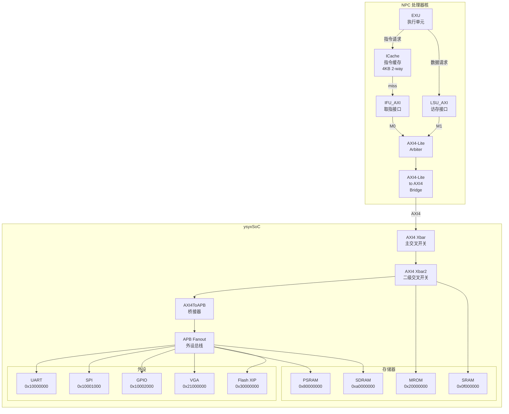
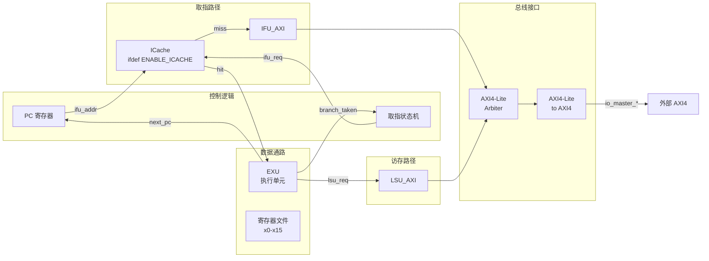
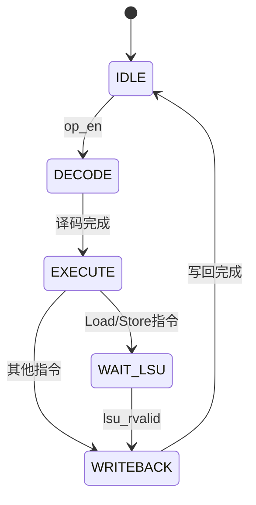
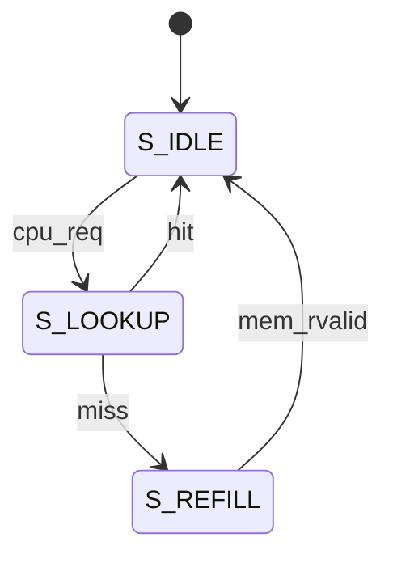
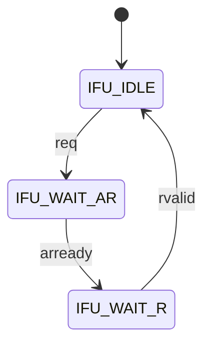
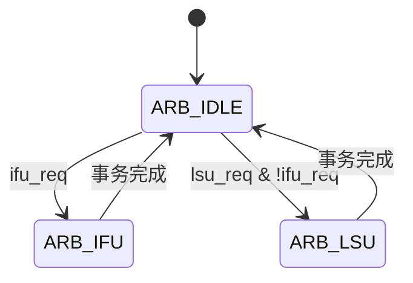
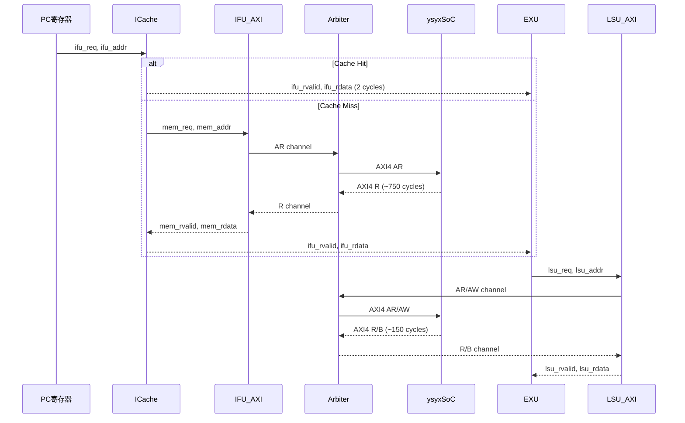
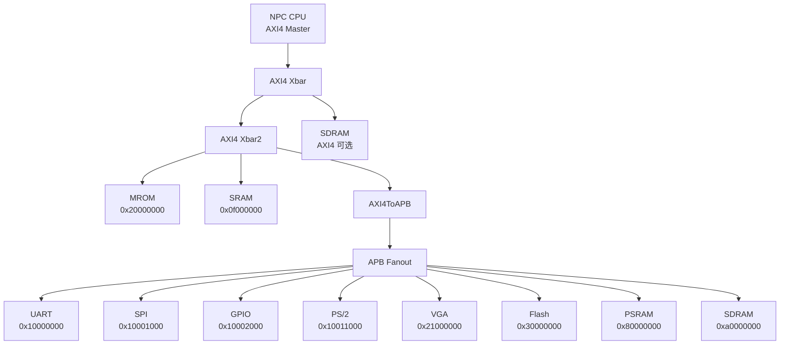
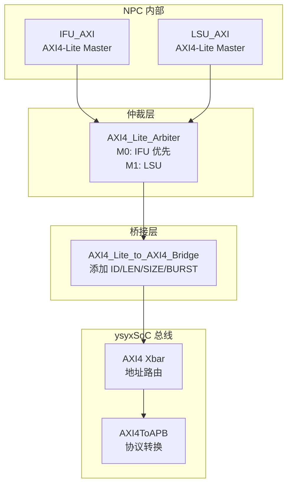

# NPC + ysyxSoC 架构文档

本文档描述 NPC 处理器和 ysyxSoC 的详细架构，便于学习理解整个系统设计。

## 目录

1. [系统整体架构](#1-系统整体架构)
2. [NPC 处理器内部架构](#2-npc-处理器内部架构)
3. [模块详细说明](#3-模块详细说明)
4. [ysyxSoC 架构](#4-ysyxsoc-架构)
5. [AXI 协议栈](#5-axi-协议栈)
6. [关键文件列表](#6-关键文件列表)

---

## 1. 系统整体架构

NPC 处理器通过 AXI4 总线接口接入 ysyxSoC，访问各种存储器和外设。

### 系统特点

- **处理器架构**: RISC-V RV32E，单发射顺序执行
- **指令缓存**: 4KB 2-way 组相联，98%+ 命中率
- **总线协议**: 内部 AXI4-Lite，外部 AXI4
- **外设访问**: 通过 APB 总线桥接

---

## 2. NPC 处理器内部架构

### 2.1 顶层模块 `ysyx_00000000.v`

### 2.2 EXU 执行单元状态机

EXU 是 NPC 的核心执行单元，采用多周期状态机设计。

**状态说明：**

| 状态 | 说明 |
|------|------|
| IDLE | 等待指令有效（op_en） |
| DECODE | 指令译码，准备操作数 |
| EXECUTE | ALU 运算、分支计算、访存地址计算 |
| WAIT_LSU | 等待 Load/Store 完成 |
| WRITEBACK | 写回寄存器、更新 PC |

### 2.3 ICache 状态机

ICache 采用 2-way 组相联设计，4KB 容量，LRU 替换策略。

**ICache 参数：**

| 参数 | 数值 | 说明 |
|------|------|------|
| 总大小 | 4 KB | 平衡面积与命中率 |
| 关联度 | 2-way | 降低冲突 miss |
| 块大小 | 4 Bytes | 1 word，简化 refill |
| 组数 | 512 sets | 4KB / 2-way / 4B |
| 地址划分 | Tag[31:11] Index[10:2] | 21-bit tag, 9-bit index |
| 替换策略 | LRU | 每组 1 bit |

### 2.4 IFU_AXI 状态机

IFU_AXI 负责从内存获取指令，采用显式三状态机设计。

### 2.5 AXI4-Lite Arbiter 状态机

仲裁器管理 IFU 和 LSU 对总线的访问，IFU 具有更高优先级。

**仲裁策略：**
- IFU (Master 0) 优先级高于 LSU (Master 1)
- 事务完成条件：读 `rvalid && rready` 或写 `bvalid && bready`

---

## 3. 模块详细说明

### 3.1 核心模块 (`npc/vsrc/core/`)

| 模块 | 文件 | 功能 |
|------|------|------|
| EXU | `EXU.v` | 指令译码、ALU、分支、CSR、LSU 控制 |
| ICache | `ICache.v` | 2-way 4KB 指令缓存，LRU 替换 |
| IFU_AXI | `IFU_AXI.v` | 取指 AXI4-Lite Master，3 状态机 |
| LSU_AXI | `LSU_AXI.v` | 访存 AXI4-Lite Master，支持字节/半字/字 |
| Arbiter | `AXI4_Lite_Arbiter.v` | IFU/LSU 请求仲裁，IFU 优先 |
| Bridge | `AXI4_Lite_to_AXI4_Bridge.v` | AXI4-Lite → AXI4 协议转换 |
| RegFile | `RegisterFile.v` | 通用寄存器文件 (x0-x15) |

### 3.2 EXU 支持的指令

| 类型 | 指令 |
|------|------|
| R 型 | ADD, SUB, SLL, SLT, SLTU, XOR, SRL, SRA, OR, AND |
| I 型 | ADDI, SLTI, SLTIU, XORI, ORI, ANDI, SLLI, SRLI, SRAI |
| Load | LB, LH, LW, LBU, LHU |
| Store | SB, SH, SW |
| Branch | BEQ, BNE, BLT, BGE, BLTU, BGEU |
| Jump | JAL, JALR |
| 其他 | LUI, AUIPC, FENCE, CSR, ECALL, EBREAK |

### 3.3 关键信号流

---

## 4. ysyxSoC 架构

### 4.1 总线层次

ysyxSoC 采用两层总线架构：AXI4 主总线 + APB 外设总线。

### 4.2 地址映射表

| 设备 | 起始地址 | 大小 | 总线 | 说明 |
|------|---------|------|------|------|
| SRAM | 0x0f000000 | 8KB | AXI4 | 片内 SRAM，栈与数据 |
| UART | 0x10000000 | 4KB | APB | 16550 兼容串口 |
| SPI | 0x10001000 | 4KB | APB | SPI 控制器 |
| GPIO | 0x10002000 | 16B | APB | 通用 IO |
| PS/2 | 0x10011000 | 8B | APB | 键盘接口 |
| MROM | 0x20000000 | 4KB | AXI4 | Boot ROM，复位入口 |
| VGA | 0x21000000 | 2MB | APB | 帧缓冲 |
| Flash | 0x30000000 | 256MB | APB | XIP Flash，程序存储 |
| PSRAM | 0x80000000 | 4MB | APB | QSPI PSRAM，主内存 |
| SDRAM | 0xa0000000 | 32MB | APB/AXI | 大容量动态内存 |

### 4.3 启动流程

1. **复位后**: PC = 0x20000000 (MROM)
2. **MROM**: 包含 bootloader，跳转到 Flash
3. **Flash**: 从 Flash XIP 读取程序
4. **拷贝**: 将 .data 段拷贝到 PSRAM
5. **运行**: 在 PSRAM 中执行程序

---

## 5. AXI 协议栈

### 5.1 协议转换层次

### 5.2 AXI4-Lite vs AXI4

| 特性 | AXI4-Lite | AXI4 |
|------|-----------|------|
| 突发传输 | 不支持 | 支持 (LEN, BURST) |
| 事务 ID | 不支持 | 支持 (ID) |
| 传输大小 | 固定 4B | 可变 (SIZE) |
| 复杂度 | 低 | 高 |

**Bridge 转换规则：**
- `awlen/arlen = 0` (单次传输)
- `awsize/arsize = 2` (4 字节)
- `awburst/arburst = 01` (INCR)
- `awid/arid = 0`

### 5.3 AXI4 通道说明

| 通道 | 方向 | 功能 |
|------|------|------|
| AW (Write Address) | Master → Slave | 写地址和控制信息 |
| W (Write Data) | Master → Slave | 写数据和字节选通 |
| B (Write Response) | Slave → Master | 写响应 |
| AR (Read Address) | Master → Slave | 读地址和控制信息 |
| R (Read Data) | Slave → Master | 读数据和响应 |

---

## 6. 关键文件列表

### 6.1 NPC 处理器

| 文件 | 说明 |
|------|------|
| `npc/vsrc/ysyx_00000000.v` | CPU 顶层模块 |
| `npc/vsrc/core/EXU.v` | 执行单元 |
| `npc/vsrc/core/ICache.v` | 指令缓存 |
| `npc/vsrc/core/IFU_AXI.v` | 取指 AXI 接口 |
| `npc/vsrc/core/LSU_AXI.v` | 访存 AXI 接口 |
| `npc/vsrc/core/AXI4_Lite_Arbiter.v` | 总线仲裁器 |
| `npc/vsrc/core/AXI4_Lite_to_AXI4_Bridge.v` | 协议桥接 |
| `npc/vsrc/core/RegisterFile.v` | 寄存器文件 |

### 6.2 ysyxSoC

| 文件 | 说明 |
|------|------|
| `ysyxSoC/src/SoC.scala` | SoC 顶层 |
| `ysyxSoC/src/CPU.scala` | CPU 接口定义 |
| `ysyxSoC/src/Xbar.scala` | 总线交叉开关 |
| `ysyxSoC/src/AXI4ToAPB.scala` | AXI4 到 APB 桥 |
| `ysyxSoC/src/device/UART16550.scala` | UART 控制器 |
| `ysyxSoC/src/device/SPI.scala` | SPI 控制器 |
| `ysyxSoC/src/device/PSRAM.scala` | PSRAM 控制器 |
| `ysyxSoC/src/device/SDRAM.scala` | SDRAM 控制器 |
| `ysyxSoC/src/device/VGA.scala` | VGA 控制器 |

### 6.3 仿真与构建

| 文件 | 说明 |
|------|------|
| `npc/Makefile.soc` | SoC 仿真 Makefile |
| `npc/csrc/main_soc.cpp` | 仿真主程序 |
| `ysyxSoC/build.sbt` | SoC 构建配置 |

---

## 7. 性能数据

### 7.1 基线 vs ICache 优化

| 指标 | 无 ICache | 有 ICache | 提升 |
|------|-----------|-----------|------|
| CPI | 950.64 | 55.33 | **17.18x** |
| 取指延迟 | ~900 cycles | 2 cycles (hit) | - |
| ICache 命中率 | - | 98.78% | - |

### 7.2 访存延迟

| 操作 | 延迟 (cycles) |
|------|--------------|
| ICache Hit | 2 |
| ICache Miss (Refill) | ~746 |
| Load (PSRAM) | ~182 |
| Store (PSRAM) | ~117 |

---

## 8. 学习建议

1. **先理解数据通路**: 从 EXU 开始，理解指令如何执行
2. **再学习总线接口**: 理解 AXI4-Lite 协议和握手机制
3. **然后研究缓存**: 理解 ICache 如何提升性能
4. **最后看 SoC 集成**: 理解外设如何访问

**推荐阅读顺序:**
1. `EXU.v` - 核心执行逻辑
2. `IFU_AXI.v` / `LSU_AXI.v` - AXI 接口
3. `AXI4_Lite_Arbiter.v` - 仲裁机制
4. `ICache.v` - 缓存设计
5. `ysyx_00000000.v` - 顶层集成
