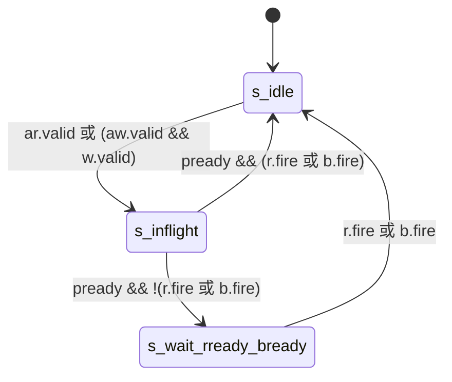
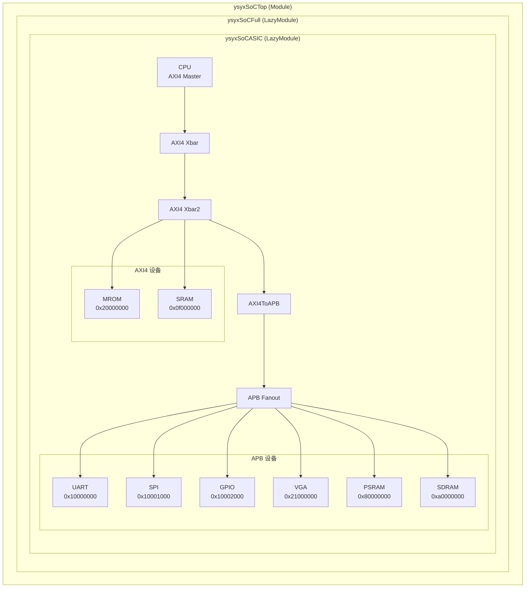
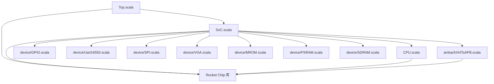

# ysyxSoC Chisel 学习讲义

> 面向 Chisel 初学者的 ysyxSoC 代码学习指南

本讲义基于 ysyxSoC 项目的真实代码，帮助初学者从零开始学习 Chisel 硬件描述语言，并理解 SoC 系统的设计方法。

---

## 目录

1. [第一部分：Chisel 基础语法入门](#第一部分chisel-基础语法入门)
2. [第二部分：Chisel 进阶语法](#第二部分chisel-进阶语法)
3. [第三部分：Diplomacy 框架入门](#第三部分diplomacy-框架入门)
4. [第四部分：ysyxSoC 代码导读](#第四部分ysyxsoc-代码导读)
5. [第五部分：实践练习（含答案）](#第五部分实践练习含答案)

---

## 第一部分：Chisel 基础语法入门

### 1.1 什么是 Chisel？

Chisel (Constructing Hardware in a Scala Embedded Language) 是一种基于 Scala 的硬件描述语言。与传统的 Verilog/VHDL 相比，Chisel 具有：

- **高级抽象能力**：利用 Scala 的面向对象和函数式编程特性
- **参数化设计**：轻松创建可配置的硬件模块
- **类型安全**：编译时检查类型错误
- **代码复用**：通过继承和组合实现模块复用

### 1.2 基本数据类型

Chisel 提供了几种基本的硬件数据类型：

#### 1.2.1 UInt - 无符号整数

```scala
// 声明一个 32 位无符号整数
val data = UInt(32.W)    // .W 表示位宽

// 字面量
val zero = 0.U           // 无符号 0
val hex = "h1234".U      // 十六进制
val bin = "b1010".U      // 二进制
val sized = 255.U(8.W)   // 8 位宽的 255
```

**ysyxSoC 示例** - 来自 `CPU.scala` 第 13 行：

```scala
def apply() = AXI4BundleParameters(addrBits = 32, dataBits = 32, idBits = ChipLinkParam.idBits)
```

这里定义了 AXI4 总线的地址宽度为 32 位，数据宽度为 32 位。

#### 1.2.2 Bool - 布尔类型

```scala
val flag = Bool()        // 1 位布尔信号
val t = true.B           // 字面量 true
val f = false.B          // 字面量 false
```

**ysyxSoC 示例** - 来自 `CPU.scala` 第 20 行：

```scala
val io_interrupt = Input(Bool())  // CPU 中断输入信号
```

#### 1.2.3 Vec - 向量类型

```scala
// 8 个 8 位元素的向量
val seg = Vec(8, UInt(8.W))
```

**ysyxSoC 示例** - 来自 `GPIO.scala` 第 14 行：

```scala
val seg = Output(Vec(8, UInt(8.W)))  // 8 个七段数码管，每个 8 位
```

#### 1.2.4 Clock 和 Reset

```scala
val clock = Input(Clock())   // 时钟信号
val reset = Input(Reset())   // 复位信号（可以是同步或异步）
```

**ysyxSoC 示例** - 来自 `CPU.scala` 第 18-19 行：

```scala
val clock = Input(Clock())
val reset = Input(Reset())
```

### 1.3 Bundle - 信号组

Bundle 用于将多个信号组合成一个结构体，类似于 Verilog 中的 struct 或接口。

#### 1.3.1 基本 Bundle 定义

**ysyxSoC 示例** - 来自 `GPIO.scala` 第 11-15 行：

```scala
class GPIOIO extends Bundle {
  val out = Output(UInt(16.W))       // 16 位输出
  val in = Input(UInt(16.W))         // 16 位输入
  val seg = Output(Vec(8, UInt(8.W))) // 8 个七段数码管
}
```

**关键点：**
- `Output()` 表示信号方向为输出
- `Input()` 表示信号方向为输入
- Bundle 中的字段通过 `val` 声明

#### 1.3.2 嵌套 Bundle

Bundle 可以嵌套使用：

**ysyxSoC 示例** - 来自 `GPIO.scala` 第 17-22 行：

```scala
class GPIOCtrlIO extends Bundle {
  val clock = Input(Clock())
  val reset = Input(Reset())
  val in = Flipped(new APBBundle(...))  // APB 总线接口
  val gpio = new GPIOIO                  // 嵌套 GPIOIO Bundle
}
```

#### 1.3.3 Flipped - 翻转方向

`Flipped()` 用于翻转 Bundle 中所有信号的方向：

```scala
// 原始方向
class MyBundle extends Bundle {
  val valid = Output(Bool())
  val data = Output(UInt(8.W))
}

// Flipped 后
val flipped = Flipped(new MyBundle)
// valid 变成 Input
// data 变成 Input
```

**ysyxSoC 示例** - 来自 `CPU.scala` 第 22 行：

```scala
val io_slave = Flipped(AXI4Bundle(CPUAXI4BundleParameters()))
```

这里将 AXI4Bundle（默认是 Master 视角）翻转为 Slave 视角。

### 1.4 Module - 模块定义

Module 是 Chisel 中硬件模块的基本单位。

#### 1.4.1 基本 Module 结构

```scala
class MyModule extends Module {
  val io = IO(new Bundle {
    val in = Input(UInt(8.W))
    val out = Output(UInt(8.W))
  })
  
  // 硬件逻辑
  io.out := io.in
}
```

**ysyxSoC 示例** - 来自 `Top.scala` 第 13-21 行：

```scala
class ysyxSoCTop extends Module {
  implicit val config: Parameters = new Config(new Edge32BitConfig ++ new DefaultRV32Config)

  val io = IO(new Bundle { })           // 空的 IO Bundle
  val dut = LazyModule(new ysyxSoCFull) // 实例化 SoC
  val mdut = Module(dut.module)         // 获取模块实现
  mdut.dontTouchPorts()
  mdut.externalPins := DontCare         // 未连接的信号设为 DontCare
}
```

**关键点：**
- 每个 Module 必须有一个 `io` 端口
- 使用 `Module(new ...)` 实例化子模块
- `DontCare` 用于标记未使用的信号

### 1.5 BlackBox - 封装外部模块

BlackBox 用于在 Chisel 中封装 Verilog/VHDL 编写的外部模块。

#### 1.5.1 基本 BlackBox

**ysyxSoC 示例** - 来自 `CPU.scala` 第 16-24 行：

```scala
class ysyx_00000000 extends BlackBox {
  val io = IO(new Bundle {
    val clock = Input(Clock())
    val reset = Input(Reset())
    val io_interrupt = Input(Bool())
    val io_master = AXI4Bundle(CPUAXI4BundleParameters())
    val io_slave = Flipped(AXI4Bundle(CPUAXI4BundleParameters()))
  })
}
```

**关键点：**
- BlackBox 的 IO 名称会直接映射到 Verilog 端口名
- 不需要（也不能）在 BlackBox 内写硬件逻辑
- BlackBox 用于集成现有的 Verilog IP

#### 1.5.2 带内联 Verilog 的 BlackBox

**ysyxSoC 示例** - 来自 `MROM.scala` 第 11-30 行：

```scala
class MROMHelper extends BlackBox with HasBlackBoxInline {
  val io = IO(new Bundle {
    val raddr = Input(UInt(32.W))
    val ren = Input(Bool())
    val rdata = Output(UInt(32.W))
  })
  setInline("MROMHelper.v",
    """module MROMHelper(
      |  input [31:0] raddr,
      |  input ren,
      |  output reg [31:0] rdata
      |);
      |import "DPI-C" function void mrom_read(input int raddr, output int rdata);
      |always @(*) begin
      |  if (ren) mrom_read(raddr, rdata);
      |  else rdata = 0;
      |end
      |endmodule
    """.stripMargin)
}
```

**关键点：**
- `HasBlackBoxInline` trait 允许内联 Verilog 代码
- `setInline()` 方法定义生成的 Verilog 文件名和内容
- 这种方式适合简单的辅助模块

### 1.6 模块实例化与连接

#### 1.6.1 实例化模块

```scala
val myModule = Module(new MyModule)
```

**ysyxSoC 示例** - 来自 `GPIO.scala` 第 46-50 行：

```scala
val mgpio = Module(new gpio_top_apb)  // 实例化 GPIO 控制器 BlackBox
mgpio.io.clock := clock               // 连接时钟
mgpio.io.reset := reset               // 连接复位
mgpio.io.in <> in                     // 双向连接 APB 接口
gpio_bundle <> mgpio.io.gpio          // 双向连接 GPIO 接口
```

#### 1.6.2 连接操作符

| 操作符 | 说明 | 示例 |
|--------|------|------|
| `:=` | 单向连接（左边被右边驱动） | `a := b` |
| `<>` | 双向连接（自动匹配方向） | `a <> b` |

```scala
// 单向连接：clock 驱动 mgpio.io.clock
mgpio.io.clock := clock

// 双向连接：Bundle 中的 Input/Output 自动匹配
mgpio.io.in <> in
```

---

## 第二部分：Chisel 进阶语法

### 2.1 寄存器

Chisel 提供多种寄存器原语：

#### 2.1.1 Reg - 基本寄存器

```scala
val reg = Reg(UInt(8.W))      // 无初值寄存器
reg := io.in                   // 每个时钟周期更新
```

#### 2.1.2 RegInit - 带初值寄存器

```scala
val counter = RegInit(0.U(8.W))  // 初值为 0
counter := counter + 1.U
```

**ysyxSoC 示例** - 来自 `AXI4ToAPB.scala` 第 50 行：

```scala
val state = RegInit(s_idle)  // 状态机初始状态为 s_idle
```

#### 2.1.3 RegEnable - 条件更新寄存器

```scala
val data_reg = RegEnable(next_data, enable_signal)
// 等价于：
// when (enable_signal) { data_reg := next_data }
```

**ysyxSoC 示例** - 来自 `AXI4ToAPB.scala` 第 67-68 行：

```scala
val rid_reg = RegEnable(ar.bits.id, accept_read)   // 读 ID 寄存器
val bid_reg = RegEnable(aw.bits.id, accept_write)  // 写 ID 寄存器
```

#### 2.1.4 RegNext - 延迟一拍

```scala
val delayed = RegNext(signal)  // signal 延迟一个时钟周期
```

### 2.2 组合逻辑

#### 2.2.1 Wire - 组合逻辑连线

```scala
val sum = Wire(UInt(8.W))
sum := a + b
```

#### 2.2.2 Mux - 多路选择器

```scala
val result = Mux(sel, a, b)  // sel ? a : b
```

**ysyxSoC 示例** - 来自 `MROM.scala` 第 52-54 行：

```scala
state := Mux(state === stateIdle,
           Mux(in.ar.fire, stateWaitRready, stateIdle),
           Mux(in.r.fire, stateIdle, stateWaitRready))
```

这是一个嵌套的 Mux，实现两状态状态机：
- 如果当前是 `stateIdle`：收到读请求则跳转到 `stateWaitRready`
- 如果当前是 `stateWaitRready`：响应完成则返回 `stateIdle`

#### 2.2.3 when/elsewhen/otherwise

```scala
when (condition1) {
  // 条件 1 成立
}.elsewhen (condition2) {
  // 条件 2 成立
}.otherwise {
  // 其他情况
}
```

#### 2.2.4 Cat - 位拼接

```scala
val combined = Cat(high, low)  // 拼接 high 和 low
```

#### 2.2.5 Fill - 位复制

```scala
val extended = Fill(4, bit)  // 将 bit 复制 4 次
```

**ysyxSoC 示例** - 来自 `AXI4ToAPB.scala` 第 89 行：

```scala
r.bits.data := Fill(2, out.prdata holdUnless (state === s_inflight))
```

将 32 位 APB 读数据复制 2 次，得到 64 位 AXI 数据。

#### 2.2.6 holdUnless - 条件保持

`holdUnless` 是 Rocket Chip 提供的扩展方法，在条件不满足时保持当前值：

```scala
val held = value holdUnless condition
// 等价于：Mux(condition, value, RegNext(held))
```

**ysyxSoC 示例** - 来自 `AXI4ToAPB.scala` 第 53, 69-72 行：

```scala
val is_write = accept_write holdUnless (state === s_idle)
val araddr_reg = ar.bits.addr holdUnless accept_read
val awaddr_reg = aw.bits.addr holdUnless accept_write
val wdata_reg  = w.bits.data holdUnless accept_write
val wstrb_reg  = w.bits.strb holdUnless accept_write
```

### 2.3 状态机

#### 2.3.1 Enum 枚举状态

```scala
val s_idle :: s_running :: s_done :: Nil = Enum(3)
```

**ysyxSoC 示例** - 来自 `AXI4ToAPB.scala` 第 49 行：

```scala
val s_idle :: s_inflight :: s_wait_rready_bready :: Nil = Enum(3)
```

这定义了 3 个状态：
- `s_idle`: 空闲状态
- `s_inflight`: 传输进行中
- `s_wait_rready_bready`: 等待响应被接收

#### 2.3.2 switch/is 状态切换

```scala
switch (state) {
  is (s_idle) {
    // 空闲状态逻辑
  }
  is (s_running) {
    // 运行状态逻辑
  }
}
```

**ysyxSoC 示例** - 来自 `AXI4ToAPB.scala` 第 54-58 行：

```scala
switch (state) {
  is (s_idle) { 
    state := Mux(ar.valid || (aw.valid && w.valid), s_inflight, s_idle) 
  }
  is (s_inflight) { 
    state := Mux(out.pready, Mux(r.fire || b.fire, s_idle, s_wait_rready_bready), s_inflight) 
  }
  is (s_wait_rready_bready) { 
    state := Mux(r.fire || b.fire, s_idle, s_wait_rready_bready) 
  }
}
```

**状态转移图：**



### 2.4 断言

```scala
assert(condition, "error message")
```

**ysyxSoC 示例** - 来自 `AXI4ToAPB.scala` 第 61-65 行：

```scala
// 不支持突发传输
assert(!(ar.valid && ar.bits.len =/= 0.U))
assert(!(aw.valid && aw.bits.len =/= 0.U))
// 不支持大于 4 字节的传输
assert(!(ar.valid && ar.bits.size > "b10".U))
assert(!(aw.valid && aw.bits.size > "b10".U))
```

### 2.5 fire 信号

在 valid-ready 握手协议中，`fire` 表示握手成功：

```scala
// fire = valid && ready
in.ar.fire  // 读地址通道握手成功
in.r.fire   // 读数据通道握手成功
```

**ysyxSoC 示例** - 来自 `MROM.scala` 第 53-57 行：

```scala
state := Mux(state === stateIdle,
           Mux(in.ar.fire, stateWaitRready, stateIdle),  // AR 握手成功
           Mux(in.r.fire, stateIdle, stateWaitRready))   // R 握手成功

mrom.io.ren := in.ar.fire  // 读使能 = AR 握手成功
```

---

## 第三部分：Diplomacy 框架入门

ysyxSoC 使用 Rocket Chip 的 Diplomacy 框架来实现参数化的模块连接。

### 3.1 为什么需要 Diplomacy？

传统方式连接模块时，参数需要手动匹配：

```scala
// 传统方式 - 参数需要手动确保一致
val master = Module(new AXIMaster(addrWidth = 32, dataWidth = 64))
val slave = Module(new AXISlave(addrWidth = 32, dataWidth = 64))  // 必须手动保持一致
```

Diplomacy 通过"参数协商"机制自动解决这个问题。

### 3.2 LazyModule

LazyModule 是 Diplomacy 的核心概念，它延迟模块的实例化直到参数协商完成。

#### 3.2.1 LazyModule 结构

```scala
class MyLazyModule(implicit p: Parameters) extends LazyModule {
  // 1. 声明节点（用于参数协商）
  val node = ...
  
  // 2. 延迟实例化模块实现
  lazy val module = new Impl
  class Impl extends LazyModuleImp(this) {
    // 3. 硬件逻辑在这里
  }
}
```

**ysyxSoC 示例** - 来自 `SoC.scala` 第 26-101 行：

```scala
class ysyxSoCASIC(implicit p: Parameters) extends LazyModule {
  // 1. 声明节点
  val xbar = AXI4Xbar()                // AXI4 交叉开关
  val xbar2 = AXI4Xbar()               // 二级交叉开关
  val apbxbar = LazyModule(new APBFanout).node  // APB 分发器
  val cpu = LazyModule(new CPU(idBits = ChipLinkParam.idBits))
  
  // ... 外设实例化 ...
  
  // 2. 节点连接
  xbar := cpu.masterNode
  
  // 3. 模块实现
  override lazy val module = new Impl
  class Impl extends LazyModuleImp(this) with DontTouch {
    // 硬件逻辑
  }
}
```

### 3.3 Node - 节点

Node 是 Diplomacy 中用于参数协商的核心抽象。

#### 3.3.1 常用节点类型

| 节点类型 | 说明 | 示例 |
|----------|------|------|
| `AXI4MasterNode` | AXI4 主设备节点 | CPU 发出请求 |
| `AXI4SlaveNode` | AXI4 从设备节点 | 存储器接收请求 |
| `APBSlaveNode` | APB 从设备节点 | 外设接收请求 |
| `AXI4Xbar` | AXI4 交叉开关 | 路由请求 |

**ysyxSoC 示例** - 来自 `CPU.scala` 第 27-31 行：

```scala
val masterNode = AXI4MasterNode(p(ExtIn).map(params =>
  AXI4MasterPortParameters(
    masters = Seq(AXI4MasterParameters(
      name = "cpu",
      id   = IdRange(0, 1 << idBits))))).toSeq)
```

**ysyxSoC 示例** - 来自 `GPIO.scala` 第 33-39 行：

```scala
val node = APBSlaveNode(Seq(APBSlavePortParameters(
  Seq(APBSlaveParameters(
    address       = address,
    executable    = true,
    supportsRead  = true,
    supportsWrite = true)),
  beatBytes  = 4)))
```

### 3.4 节点连接语法

Diplomacy 使用 `:=` 操作符连接节点，**方向从右到左**：

```scala
slave := master  // master 的输出连接到 slave 的输入
```

#### 3.4.1 直接连接

```scala
xbar := cpu.masterNode  // CPU 连接到交叉开关
```

#### 3.4.2 通过适配器连接

```scala
xbar2 := AXI4UserYanker(Some(1)) := AXI4Fragmenter() := xbar
```

这表示：
1. `xbar` 的输出
2. 经过 `AXI4Fragmenter()`（分片器）
3. 经过 `AXI4UserYanker()`（用户字段移除器）
4. 连接到 `xbar2`

**ysyxSoC 示例** - 来自 `SoC.scala` 第 50-56 行：

```scala
// APB 外设连接
List(lspi.node, luart.node, lpsram.node, lgpio.node, lkeyboard.node, lvga.node).map(_ := apbxbar)

// AXI4 设备连接
List(apbxbar := APBDelayer() := AXI4ToAPB() := AXI4Buffer(), lmrom.node, sramNode).map(_ := xbar2)

// 交叉开关连接
xbar2 := AXI4UserYanker(Some(1)) := AXI4Fragmenter() := xbar

// CPU 连接
xbar := cpu.masterNode
```

### 3.5 获取节点数据

在 `LazyModuleImp` 中，通过 `node.in` 和 `node.out` 获取连接的数据：

```scala
class Impl extends LazyModuleImp(this) {
  val (in, _) = node.in(0)   // 获取第一个输入端口
  val (out, _) = node.out(0) // 获取第一个输出端口
}
```

**ysyxSoC 示例** - 来自 `GPIO.scala` 第 43 行：

```scala
val (in, _) = node.in(0)  // 获取 APB 输入接口
```

**ysyxSoC 示例** - 来自 `CPU.scala` 第 34 行：

```scala
val (master, _) = masterNode.out(0)  // 获取 AXI4 输出接口
```

### 3.6 Module vs LazyModule 对比

| 特性 | Module | LazyModule |
|------|--------|------------|
| 实例化时机 | 立即实例化 | 延迟到 elaborate |
| 参数协商 | 不支持 | 支持（通过 Node） |
| 使用场景 | 简单模块 | 需要参数协商的模块 |
| 实现方式 | 直接在类中写逻辑 | 在 `LazyModuleImp` 中写逻辑 |
| 实例化语法 | `Module(new X)` | `LazyModule(new X)` |

---

## 第四部分：ysyxSoC 代码导读

### 4.1 系统架构总览



### 4.2 地址映射表

| 设备 | 起始地址 | 大小 | 总线 | 说明 |
|------|---------|------|------|------|
| SRAM | 0x0f000000 | 8KB | AXI4 | 片内 SRAM |
| UART | 0x10000000 | 4KB | APB | 16550 串口 |
| SPI | 0x10001000 | 4KB | APB | SPI 控制器 |
| GPIO | 0x10002000 | 16B | APB | 通用 IO |
| PS/2 | 0x10011000 | 8B | APB | 键盘接口 |
| MROM | 0x20000000 | 4KB | AXI4 | Boot ROM |
| VGA | 0x21000000 | 2MB | APB | 帧缓冲 |
| Flash | 0x30000000 | 256MB | APB | XIP Flash |
| PSRAM | 0x80000000 | 4MB | APB | 主内存 |
| SDRAM | 0xa0000000 | 32MB | APB | 大容量内存 |

### 4.3 文件结构

```
ysyxSoC/src/
├── Top.scala           # 顶层模块，Verilog 生成入口
├── SoC.scala           # SoC 核心实现，总线连接
├── CPU.scala           # CPU 接口封装
├── amba/
│   ├── AXI4ToAPB.scala # AXI4 到 APB 协议转换
│   ├── AXI4Delayer.scala
│   └── APBDelayer.scala
├── device/
│   ├── GPIO.scala      # GPIO 控制器
│   ├── Uart16550.scala # UART 控制器
│   ├── SPI.scala       # SPI 控制器
│   ├── VGA.scala       # VGA 控制器
│   ├── MROM.scala      # 只读存储器
│   ├── PSRAM.scala     # PSRAM 控制器
│   └── SDRAM.scala     # SDRAM 控制器
└── util/
    └── TriState.scala  # 三态缓冲器
```

### 4.4 推荐学习顺序

| 阶段 | 文件 | 学习目标 |
|------|------|----------|
| 1 | GPIO.scala | Bundle、BlackBox、APB 节点基础 |
| 2 | Uart16550.scala | 巩固 APB 外设模式 |
| 3 | CPU.scala | AXI4 Master 节点、BlackBox 封装 |
| 4 | MROM.scala | AXI4 Slave 实现、简单状态机 |
| 5 | AXI4ToAPB.scala | 协议转换、复杂状态机 |
| 6 | SoC.scala | 完整系统集成、节点连接 |
| 7 | Top.scala | 顶层封装、Verilog 生成 |

### 4.5 代码依赖关系



### 4.6 关键代码解读

#### 4.6.1 SoC 总线连接（SoC.scala）

```scala
// CPU 连接到主交叉开关
xbar := cpu.masterNode

// 主交叉开关经过适配器连接到二级交叉开关
xbar2 := AXI4UserYanker(Some(1)) := AXI4Fragmenter() := xbar

// 二级交叉开关连接 AXI4 设备和 APB 桥
List(apbxbar := APBDelayer() := AXI4ToAPB() := AXI4Buffer(), lmrom.node, sramNode).map(_ := xbar2)

// APB 外设连接到 APB 分发器
List(lspi.node, luart.node, lpsram.node, lgpio.node, lkeyboard.node, lvga.node).map(_ := apbxbar)
```

**数据流：**
```
CPU → xbar → AXI4Fragmenter → AXI4UserYanker → xbar2
                                                  ├→ MROM (AXI4)
                                                  ├→ SRAM (AXI4)
                                                  └→ AXI4Buffer → AXI4ToAPB → APBDelayer → apbxbar
                                                                                              ├→ UART
                                                                                              ├→ SPI
                                                                                              ├→ GPIO
                                                                                              └→ ...
```

#### 4.6.2 AXI4ToAPB 协议转换（AXI4ToAPB.scala）

这是一个将 AXI4 协议转换为 APB 协议的桥接器：

```scala
// 状态定义
val s_idle :: s_inflight :: s_wait_rready_bready :: Nil = Enum(3)
val state = RegInit(s_idle)

// 接收读/写请求
val accept_read = (state === s_idle) && ar.valid
val accept_write = !accept_read && (state === s_idle) && aw.valid && w.valid

// 状态机
switch (state) {
  is (s_idle) { 
    state := Mux(ar.valid || (aw.valid && w.valid), s_inflight, s_idle) 
  }
  is (s_inflight) { 
    state := Mux(out.pready, Mux(r.fire || b.fire, s_idle, s_wait_rready_bready), s_inflight) 
  }
  is (s_wait_rready_bready) { 
    state := Mux(r.fire || b.fire, s_idle, s_wait_rready_bready) 
  }
}

// APB 信号生成
out.psel    := (accept_read || accept_write) || out.penable
out.penable := state === s_inflight
out.pwrite  := is_write
out.paddr   := Mux(is_write, awaddr_reg, araddr_reg)
```

---

## 第五部分：实践练习（含答案）

### 5.1 基础阅读题

**题目 1：找出 GPIO 模块的地址范围**

**答案：** `0x10002000` 起始，大小 `0x10`（16 字节）

```scala
// SoC.scala 第 35 行
val lgpio = LazyModule(new APBGPIO(AddressSet.misaligned(0x10002000, 0x10)))
```

---

**题目 2：UART 模块使用什么总线协议？**

**答案：** APB 总线协议

```scala
// Uart16550.scala 第 25-32 行
class APBUart16550(address: Seq[AddressSet]) extends LazyModule {
  val node = APBSlaveNode(Seq(APBSlavePortParameters(...)))
}
```

---

**题目 3：CPU 的 AXI4 接口数据位宽是多少？**

**答案：** 32 位

```scala
// CPU.scala 第 13 行
def apply() = AXI4BundleParameters(addrBits = 32, dataBits = 32, idBits = ChipLinkParam.idBits)
```

---

**题目 4：SPI 控制器映射了哪两个地址空间？**

**答案：**
- SPI 控制器寄存器：`0x10001000`，大小 `0x1000`
- XIP Flash：`0x30000000`，大小 `0x10000000`（256MB）

```scala
// SoC.scala 第 38-41 行
val lspi = LazyModule(new APBSPI(
  AddressSet.misaligned(0x10001000, 0x1000) ++    // SPI controller
  AddressSet.misaligned(0x30000000, 0x10000000)   // XIP flash
))
```

---

**题目 5：MROM 的起始地址是什么？这是系统复位后 PC 的初始值吗？**

**答案：** `0x20000000`，是的，这是复位后 PC 的初始值（Boot ROM）

```scala
// SoC.scala 第 43 行
val lmrom = LazyModule(new AXI4MROM(AddressSet.misaligned(0x20000000, 0x1000)))
```

---

### 5.2 代码理解题

**题目 6：解释 AXI4ToAPB 中的状态机有几个状态？各状态的作用是什么？**

**答案：** 3 个状态

```scala
// AXI4ToAPB.scala 第 49 行
val s_idle :: s_inflight :: s_wait_rready_bready :: Nil = Enum(3)
```

- `s_idle`：空闲状态，等待 AR（读）或 AW+W（写）请求
- `s_inflight`：传输进行中，等待 APB 的 pready 信号
- `s_wait_rready_bready`：等待 AXI 主设备接收响应（r.ready 或 b.ready）

---

**题目 7：`holdUnless` 的作用是什么？在哪里使用了？**

**答案：** `holdUnless` 用于在条件不满足时保持当前值不变。

```scala
// AXI4ToAPB.scala 第 53, 69-72 行
val is_write = accept_write holdUnless (state === s_idle)
val araddr_reg = ar.bits.addr holdUnless accept_read
val awaddr_reg = aw.bits.addr holdUnless accept_write
```

相当于：`Mux(condition, newValue, RegNext(currentValue))`

---

**题目 8：`:=` 和 `<>` 连接操作符有什么区别？**

**答案：**
- `:=` 单向连接，左边被右边驱动
- `<>` 双向连接，自动匹配 Input/Output 方向

```scala
// CPU.scala 示例
cpu.io.clock := clock          // 单向：clock 驱动 cpu.io.clock
cpu.io.io_slave <> slave       // 双向：Bundle 自动匹配方向
master <> cpu.io.io_master     // 双向连接
```

---

**题目 9：为什么 CPU 模块要用 BlackBox 而不是直接用 Chisel 实现？**

**答案：** 因为 CPU 核心（`ysyx_00000000`）是用 Verilog 实现的外部模块，Chisel 通过 BlackBox 机制封装外部 HDL 代码。

```scala
// CPU.scala 第 16-24 行
class ysyx_00000000 extends BlackBox {
  val io = IO(new Bundle {
    val clock = Input(Clock())
    val reset = Input(Reset())
    val io_interrupt = Input(Bool())
    val io_master = AXI4Bundle(CPUAXI4BundleParameters())
    val io_slave = Flipped(AXI4Bundle(CPUAXI4BundleParameters()))
  })
}
```

---

**题目 10：`Flipped()` 的作用是什么？**

**答案：** 翻转 Bundle 中所有信号的方向（Input 变 Output，Output 变 Input）

```scala
// CPU.scala 第 22 行
val io_slave = Flipped(AXI4Bundle(CPUAXI4BundleParameters()))
// AXI4Bundle 默认是 Master 视角（输出地址/数据，输入响应）
// Flipped 后变成 Slave 视角（输入地址/数据，输出响应）
```

---

### 5.3 架构分析题

**题目 11：从 CPU 发出的读请求到达 UART 需要经过哪些模块？**

**答案：** 请求路径如下

```
CPU (AXI4 Master)
  ↓ xbar := cpu.masterNode
AXI4 Xbar (xbar)
  ↓ xbar2 := AXI4UserYanker() := AXI4Fragmenter() := xbar
AXI4 Xbar2 (xbar2)
  ↓ apbxbar := APBDelayer() := AXI4ToAPB() := AXI4Buffer() := xbar2
AXI4ToAPB (协议转换)
  ↓
APB Fanout (apbxbar)
  ↓ luart.node := apbxbar
UART (APBUart16550)
```

---

**题目 12：ysyxSoC 中有哪些设备使用 AXI4 协议，哪些使用 APB 协议？**

**答案：**

**AXI4 设备：**
- MROM (`AXI4MROM`)
- SRAM (`AXI4RAM`)
- SDRAM（可选 `AXI4SDRAM`，通过 `Config.sdramUseAXI` 配置）

**APB 设备：**
- UART (`APBUart16550`)
- GPIO (`APBGPIO`)
- SPI (`APBSPI`)
- VGA (`APBVGA`)
- Keyboard (`APBKeyboard`)
- PSRAM (`APBPSRAM`)
- SDRAM (`APBSDRAM`，默认）

---

**题目 13：`LazyModule` 和普通 `Module` 有什么区别？**

**答案：**

| 特性 | Module | LazyModule |
|------|--------|------------|
| 实例化时机 | 立即实例化 | 延迟到 elaborate |
| 参数协商 | 不支持 | 支持（通过 Node） |
| 使用场景 | 简单模块 | 需要参数协商的模块 |
| 实现方式 | 直接在类中写逻辑 | 在 `LazyModuleImp` 中写逻辑 |

```scala
// 普通 Module
class ysyxSoCTop extends Module {
  val io = IO(...)
  // 直接写硬件逻辑
}

// LazyModule
class ysyxSoCASIC extends LazyModule {
  val node = AXI4Xbar()  // 声明节点
  lazy val module = new Impl  // 延迟实例化
  class Impl extends LazyModuleImp(this) {
    // 硬件逻辑在这里
  }
}
```

---

### 5.4 语法练习题

**题目 14：写出一个 8 位计数器的 Chisel 代码**

**答案：**

```scala
class Counter8 extends Module {
  val io = IO(new Bundle {
    val en = Input(Bool())
    val count = Output(UInt(8.W))
  })
  
  val cnt = RegInit(0.U(8.W))
  when (io.en) {
    cnt := cnt + 1.U
  }
  io.count := cnt
}
```

---

**题目 15：写出一个简单的 2 选 1 多路选择器**

**答案：**

```scala
class Mux2to1 extends Module {
  val io = IO(new Bundle {
    val sel = Input(Bool())
    val in0 = Input(UInt(32.W))
    val in1 = Input(UInt(32.W))
    val out = Output(UInt(32.W))
  })
  
  io.out := Mux(io.sel, io.in1, io.in0)
  // 或者用 when/otherwise：
  // when (io.sel) { io.out := io.in1 }
  // .otherwise { io.out := io.in0 }
}
```

---

**题目 16：写出一个带同步复位的 D 触发器**

**答案：**

```scala
class DFlipFlop extends Module {
  val io = IO(new Bundle {
    val d = Input(Bool())
    val q = Output(Bool())
  })
  
  val reg = RegInit(false.B)  // 同步复位，初值为 false
  reg := io.d
  io.q := reg
}
```

---

**题目 17：定义一个 AXI4-Lite 读通道的 Bundle**

**答案：**

```scala
class AXI4LiteReadChannel extends Bundle {
  // 读地址通道
  val arvalid = Output(Bool())
  val arready = Input(Bool())
  val araddr = Output(UInt(32.W))
  
  // 读数据通道
  val rvalid = Input(Bool())
  val rready = Output(Bool())
  val rdata = Input(UInt(32.W))
  val rresp = Input(UInt(2.W))
}
```

---

**题目 18：使用 Vec 创建一个 4 个 32 位寄存器的寄存器文件**

**答案：**

```scala
class RegFile4x32 extends Module {
  val io = IO(new Bundle {
    val raddr = Input(UInt(2.W))
    val rdata = Output(UInt(32.W))
    val wen = Input(Bool())
    val waddr = Input(UInt(2.W))
    val wdata = Input(UInt(32.W))
  })
  
  val regs = RegInit(VecInit(Seq.fill(4)(0.U(32.W))))
  
  io.rdata := regs(io.raddr)
  when (io.wen) {
    regs(io.waddr) := io.wdata
  }
}
```

---

### 5.5 综合题

**题目 19：分析下面的代码，说明其功能**

```scala
val state = RegInit(stateIdle)
state := Mux(state === stateIdle,
           Mux(in.ar.fire, stateWaitRready, stateIdle),
           Mux(in.r.fire, stateIdle, stateWaitRready))
```

**答案：** 这是一个两状态的状态机：

- 当前在 `stateIdle`：如果 `ar.fire`（AR 通道握手成功），跳转到 `stateWaitRready`；否则保持 `stateIdle`
- 当前在 `stateWaitRready`：如果 `r.fire`（R 通道握手成功），返回 `stateIdle`；否则保持 `stateWaitRready`

这是一个典型的 AXI 读事务状态机：空闲 → 等待读响应被接收 → 空闲

---

**题目 20：如何在 ysyxSoC 中添加一个新的 APB 外设（地址 0x10003000，大小 0x100）？**

**答案：**

1. 创建外设类（参考 GPIO.scala）：

```scala
// 新建 device/MyDevice.scala
package ysyx

import chisel3._
import freechips.rocketchip.amba.apb._
import org.chipsalliance.cde.config.Parameters
import freechips.rocketchip.diplomacy._

class APBMyDevice(address: Seq[AddressSet])(implicit p: Parameters) extends LazyModule {
  val node = APBSlaveNode(Seq(APBSlavePortParameters(
    Seq(APBSlaveParameters(
      address       = address,
      supportsRead  = true,
      supportsWrite = true)),
    beatBytes = 4)))

  lazy val module = new Impl
  class Impl extends LazyModuleImp(this) {
    val (in, _) = node.in(0)
    // 实现外设逻辑
    in.pready := true.B
    in.pslverr := false.B
    in.prdata := 0.U
  }
}
```

2. 在 SoC.scala 中实例化并连接：

```scala
// 在 ysyxSoCASIC 类中添加
val lmydev = LazyModule(new APBMyDevice(AddressSet.misaligned(0x10003000, 0x100)))

// 在 List 中添加节点连接
List(lspi.node, luart.node, lpsram.node, lgpio.node, lkeyboard.node, lvga.node, lmydev.node).map(_ := apbxbar)
```

---

## 附录：常用 Chisel 语法速查表

### 数据类型

| 类型 | 声明 | 示例 |
|------|------|------|
| 无符号整数 | `UInt(n.W)` | `UInt(32.W)` |
| 有符号整数 | `SInt(n.W)` | `SInt(16.W)` |
| 布尔 | `Bool()` | `Bool()` |
| 向量 | `Vec(n, T)` | `Vec(8, UInt(8.W))` |
| 时钟 | `Clock()` | `Clock()` |
| 复位 | `Reset()` | `Reset()` |

### 字面量

| 类型 | 语法 | 示例 |
|------|------|------|
| 十进制 | `n.U` | `42.U` |
| 十六进制 | `"hXXX".U` | `"hABCD".U` |
| 二进制 | `"bXXX".U` | `"b1010".U` |
| 布尔 | `true.B` / `false.B` | `true.B` |
| 带位宽 | `n.U(w.W)` | `255.U(8.W)` |

### 寄存器

| 类型 | 语法 | 说明 |
|------|------|------|
| 基本寄存器 | `Reg(T)` | 无初值 |
| 带初值 | `RegInit(init)` | 有初值 |
| 条件更新 | `RegEnable(next, en)` | 使能时更新 |
| 延迟一拍 | `RegNext(x)` | x 延迟一拍 |

### 操作符

| 类型 | 操作符 | 说明 |
|------|--------|------|
| 算术 | `+`, `-`, `*`, `/`, `%` | 加减乘除取模 |
| 位运算 | `&`, `\|`, `^`, `~` | 与或异或非 |
| 比较 | `===`, `=/=`, `<`, `>`, `<=`, `>=` | 相等/不等/比较 |
| 移位 | `<<`, `>>` | 左移/右移 |
| 连接 | `:=`, `<>` | 单向/双向连接 |

### 控制流

```scala
// when/elsewhen/otherwise
when (cond1) {
  // ...
}.elsewhen (cond2) {
  // ...
}.otherwise {
  // ...
}

// switch/is
switch (sel) {
  is (val1) { /* ... */ }
  is (val2) { /* ... */ }
}

// Mux
Mux(sel, a, b)  // sel ? a : b
```

---

## 参考资源

1. [Chisel 官方文档](https://www.chisel-lang.org/docs)
2. [Chisel Bootcamp](https://github.com/freechipsproject/chisel-bootcamp)
3. [Rocket Chip Generator](https://github.com/chipsalliance/rocket-chip)
4. [ysyxSoC 源代码](ysyxSoC/src/)
