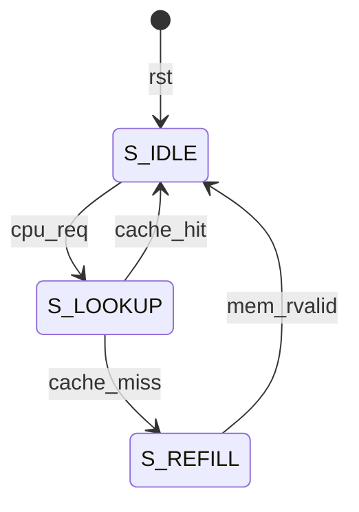

# ICache.v 逐行代码解析讲义

## 文件概述

这是一个 **4KB 的 2 路组相联指令缓存 (I-Cache)** 实现，采用 **LRU 替换策略**，每个缓存行大小为 **4 字节（1 个字）**。

---

## 第 1-8 行：模块注释说明

```verilog
// I-Cache: 4KB, 2-way set-associative, 4-byte (1-word) cache line
// Parameters:
//   - Total size: 4KB
//   - Associativity: 2-way
//   - Line size: 4 bytes (1 word) - simplifies refill, no burst needed
//   - Number of sets: 512 (4KB / 2 / 4B)
//   - Address: Tag[31:11] Index[10:2] Offset[1:0] (word-aligned)
//   - Replacement: LRU (1 bit per set)
```

| 参数 | 值 | 说明 |
|------|-----|------|
| 总大小 | 4KB | 缓存总容量 |
| 相联度 | 2-way | 每个 set 有 2 个 cache line |
| 行大小 | 4 字节 | 一个字，简化 refill 逻辑 |
| Set 数量 | 512 | 计算: 4KB / 2路 / 4字节 = 512 |
| 替换策略 | LRU | 最近最少使用 |

**地址划分** (32位地址):
- `Tag[31:11]`: 21 位标签
- `Index[10:2]`: 9 位索引 (选择 512 个 set 之一)
- `Offset[1:0]`: 2 位偏移 (字对齐，实际忽略)

---

## 第 10-25 行：模块端口定义

```verilog
module ICache (
    input clk,                    // 时钟信号
    input rst,                    // 复位信号（高有效）
    
    // Upstream interface (to CPU/EXU) - 上游接口（连接 CPU）
    input               cpu_req,      // CPU 取指请求
    input      [31:0]   cpu_addr,     // 取指地址
    output reg          cpu_rvalid,   // 数据有效信号
    output reg [31:0]   cpu_rdata,    // 返回的指令数据
    
    // Downstream interface (to memory/IFU_AXI) - 下游接口（连接内存）
    output reg          mem_req,      // 内存读请求
    output reg [31:0]   mem_addr,     // 内存地址
    input               mem_rvalid,   // 内存数据有效
    input      [31:0]   mem_rdata     // 内存返回数据
);
```

**接口架构**:
```
CPU <---> ICache <---> Memory
   上游接口     下游接口
```

---

## 第 27-34 行：参数定义

```verilog
localparam OFFSET_WIDTH = 2;    // 偏移位宽：2^2 = 4 字节
localparam INDEX_WIDTH  = 9;    // 索引位宽：2^9 = 512 sets
localparam TAG_WIDTH    = 21;   // 标签位宽：32 - 9 - 2 = 21
localparam NUM_SETS     = 512;  // set 数量
localparam NUM_WAYS     = 2;    // way 数量（2路组相联）
```

`localparam` 定义编译时常量，不可修改。

---

## 第 36-49 行：Cache 存储结构

```verilog
// Valid bits: [way][set] - 有效位数组
reg valid [0:NUM_WAYS-1][0:NUM_SETS-1];    // 2x512 = 1024 bits

// Tags: [way][set] - 标签数组
reg [TAG_WIDTH-1:0] tags [0:NUM_WAYS-1][0:NUM_SETS-1];  // 2x512x21 bits

// Data: [way][set] - 数据数组（每行一个字）
reg [31:0] data [0:NUM_WAYS-1][0:NUM_SETS-1];  // 2x512x32 bits

// LRU bits: 1 bit per set - LRU 标记
// 0 = way0 是 LRU（应被替换）, 1 = way1 是 LRU
reg lru [0:NUM_SETS-1];  // 512 bits
```

**存储结构示意**:
```
        Way 0                 Way 1
       +-------+             +-------+
Set 0  | V|Tag|Data |         | V|Tag|Data |  LRU[0]
Set 1  | V|Tag|Data |         | V|Tag|Data |  LRU[1]
  ...
Set 511| V|Tag|Data |         | V|Tag|Data |  LRU[511]
       +-------+             +-------+
```

---

## 第 51-56 行：地址分解

```verilog
reg [31:0] req_addr_reg;        // 锁存的请求地址

// 从锁存地址中提取各字段（组合逻辑）
wire [TAG_WIDTH-1:0]    req_tag   = req_addr_reg[31:11];  // 高 21 位
wire [INDEX_WIDTH-1:0]  req_index = req_addr_reg[10:2];   // 中间 9 位
// 注意：offset [1:0] 被忽略（字对齐访问）
```

为什么要锁存地址？因为 `cpu_addr` 可能在后续周期变化，而 cache 查找需要稳定的地址。

---

## 第 58-69 行：状态机定义

```verilog
localparam S_IDLE       = 2'd0;  // 空闲状态
localparam S_LOOKUP     = 2'd1;  // 查找状态
localparam S_REFILL     = 2'd2;  // 重填状态

reg [1:0] state;                 // 当前状态（2位）

// Refill 相关寄存器
reg [INDEX_WIDTH-1:0] refill_index;   // 要填充的 set 索引
reg [TAG_WIDTH-1:0] refill_tag;       // 要填充的 tag
reg refill_way;                       // 要填充的 way（从 LRU 选择）
reg refill_req_sent;                  // 标记请求是否已发送
```

**状态机流程**:
```
IDLE --[cpu_req]--> LOOKUP --[hit]--> IDLE
                       |
                    [miss]
                       v
                    REFILL --[mem_rvalid]--> IDLE
```

---

## 第 71-76 行：标签比较（组合逻辑）

```verilog
// Way 0 命中条件：有效 且 标签匹配
wire hit_way0 = valid[0][req_index] && (tags[0][req_index] == req_tag);

// Way 1 命中条件：有效 且 标签匹配
wire hit_way1 = valid[1][req_index] && (tags[1][req_index] == req_tag);

// 总命中信号
wire cache_hit = hit_way0 || hit_way1;
```

这是 **组合逻辑**（`wire`），每个周期根据输入实时计算结果。

---

## 第 78-86 行：性能计数器（仅仿真）

```verilog
`ifdef SIMULATION
    reg [63:0] perf_icache_hit_cnt;       // 命中次数
    reg [63:0] perf_icache_miss_cnt;      // 缺失次数
    reg [63:0] perf_icache_refill_cycles; // refill 总周期数
    reg [32:0] refill_cycle_counter;      // 单次 refill 周期计数
`endif
```

条件编译：只在仿真时包含这些计数器，综合时会被忽略。

---

## 第 88-124 行：复位逻辑

```verilog
integer i, j, k;  // 循环变量

always @(posedge clk or posedge rst) begin
    if (rst) begin
        // 状态机复位
        state <= S_IDLE;
        
        // 输出信号复位
        cpu_rvalid <= 1'b0;
        cpu_rdata <= 32'h0;
        mem_req <= 1'b0;
        mem_addr <= 32'h0;
        
        // 内部寄存器复位
        req_addr_reg <= 32'h0;
        refill_index <= {INDEX_WIDTH{1'b0}};  // 9'b0
        refill_tag <= {TAG_WIDTH{1'b0}};      // 21'b0
        refill_way <= 1'b0;
        refill_req_sent <= 1'b0;
        
        // 初始化所有 cache 条目为无效（使用阻塞赋值）
        for (i = 0; i < NUM_WAYS; i = i + 1) begin
            for (j = 0; j < NUM_SETS; j = j + 1) begin
                valid[i][j] = 1'b0;      // 注意：阻塞赋值 =
                tags[i][j] = {TAG_WIDTH{1'b0}};
                data[i][j] = 32'h0;
            end
        end
        
        // 初始化 LRU 位
        for (j = 0; j < NUM_SETS; j = j + 1) begin
            lru[j] = 1'b0;
        end
        
        // 性能计数器复位
`ifdef SIMULATION
        perf_icache_hit_cnt <= 64'd0;
        perf_icache_miss_cnt <= 64'd0;
        perf_icache_refill_cycles <= 64'd0;
        refill_cycle_counter <= 32'd0;
`endif
    end
```

**注意**：初始化循环使用 **阻塞赋值 `=`** 而非非阻塞赋值 `<=`，因为这是在复位时的初始化操作。

---

## 第 125-136 行：IDLE 状态

```verilog
    end else begin
        // 默认：清除请求信号
        cpu_rvalid <= 1'b0;
        
        case (state)
            S_IDLE: begin
                mem_req <= 1'b0;           // 确保内存请求关闭
                if (cpu_req) begin
                    req_addr_reg <= cpu_addr;  // 锁存地址
                    state <= S_LOOKUP;         // 进入查找状态
                end
            end
```

IDLE 状态功能：等待 CPU 请求，收到请求后锁存地址并进入 LOOKUP。

---

## 第 138-165 行：LOOKUP 状态

```verilog
            S_LOOKUP: begin
                if (cache_hit) begin
                    // === Cache 命中 ===
                    cpu_rvalid <= 1'b1;    // 数据有效
                    
                    if (hit_way0) begin
                        cpu_rdata <= data[0][req_index];  // 返回 way0 数据
                        lru[req_index] <= 1'b1;  // way0 刚用过，way1 变成 LRU
                    end else begin
                        cpu_rdata <= data[1][req_index];  // 返回 way1 数据
                        lru[req_index] <= 1'b0;  // way1 刚用过，way0 变成 LRU
                    end
                    
                    state <= S_IDLE;  // 返回空闲
`ifdef SIMULATION
                    perf_icache_hit_cnt <= perf_icache_hit_cnt + 1;
`endif
                end else begin
                    // === Cache 缺失 ===
                    refill_index <= req_index;
                    refill_tag <= req_tag;
                    refill_way <= lru[req_index];  // 选择 LRU way 替换
                    refill_req_sent <= 1'b0;
                    state <= S_REFILL;  // 进入重填状态
`ifdef SIMULATION
                    perf_icache_miss_cnt <= perf_icache_miss_cnt + 1;
                    refill_cycle_counter <= 32'd1;
`endif
                end
            end
```

**LRU 更新逻辑**：
- 访问 way0 后：`lru = 1`（way1 成为 LRU）
- 访问 way1 后：`lru = 0`（way0 成为 LRU）

---

## 第 167-199 行：REFILL 状态

```verilog
            S_REFILL: begin
`ifdef SIMULATION
                refill_cycle_counter <= refill_cycle_counter + 1;
`endif
                // 发送单次内存请求（脉冲信号）
                if (!refill_req_sent) begin
                    mem_req <= 1'b1;       // 发起请求
                    mem_addr <= {req_addr_reg[31:2], 2'b0};  // 字对齐地址
                    refill_req_sent <= 1'b1;
                end else begin
                    mem_req <= 1'b0;       // 请求只持续一个周期
                    
                    if (mem_rvalid) begin
                        // === 收到内存响应 ===
`ifdef SIMULATION
                        perf_icache_refill_cycles <= perf_icache_refill_cycles 
                                                   + {32'b0, refill_cycle_counter};
`endif
                        // 写入 cache
                        valid[refill_way][refill_index] <= 1'b1;
                        tags[refill_way][refill_index] <= refill_tag;
                        data[refill_way][refill_index] <= mem_rdata;
                        
                        // 更新 LRU（刚填充的 way 被使用了）
                        lru[refill_index] <= ~refill_way;
                        
                        // 返回数据给 CPU
                        cpu_rvalid <= 1'b1;
                        cpu_rdata <= mem_rdata;
                        
                        state <= S_IDLE;
                    end
                end
            end
```

**关键设计**：
1. `mem_req` 是**脉冲信号**，只持续一个周期
2. 使用 `refill_req_sent` 标记防止重复发送请求
3. 地址 `{req_addr_reg[31:2], 2'b0}` 确保字对齐（低 2 位清零）

---

## 第 201-206 行：默认状态处理

```verilog
            default: begin
                state <= S_IDLE;  // 异常状态恢复到 IDLE
            end
        endcase
    end
end
```

防止状态机进入未定义状态。

---

## 完整状态转换图



---

## 关键代码技巧总结

| 技术点 | 代码示例 | 说明 |
|--------|----------|------|
| 位拼接 | `{req_addr_reg[31:2], 2'b0}` | 字对齐 |
| 位复制 | `{TAG_WIDTH{1'b0}}` | 生成 21 位的 0 |
| 条件编译 | `` `ifdef SIMULATION `` | 仅仿真时有效 |
| 二维数组 | `valid[way][set]` | Verilog 2001 语法 |
| LRU 位取反 | `lru <= ~refill_way` | 简洁的 LRU 更新 |
