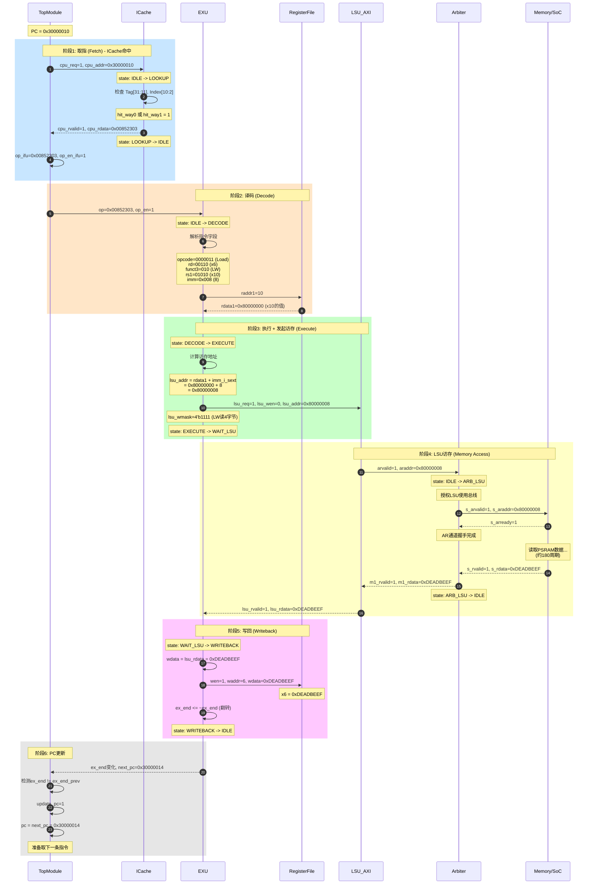
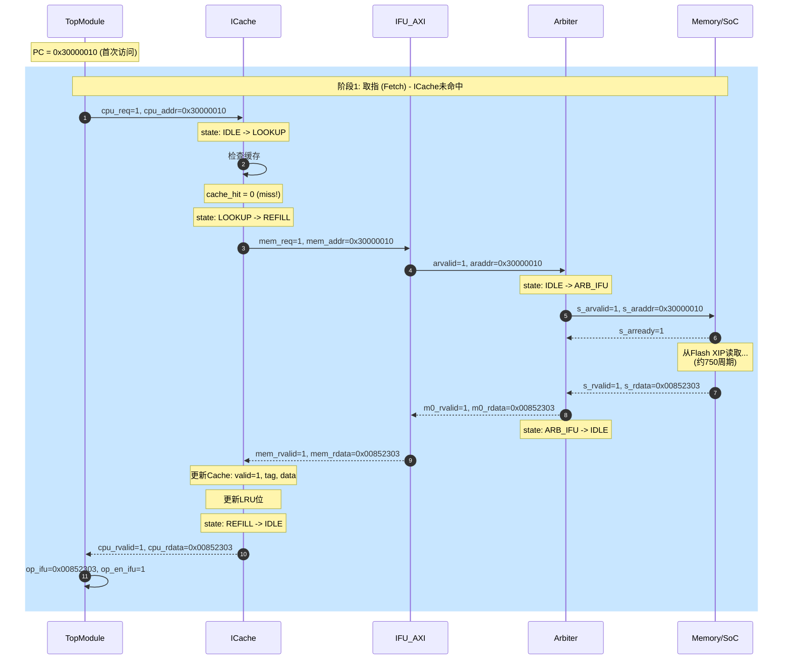
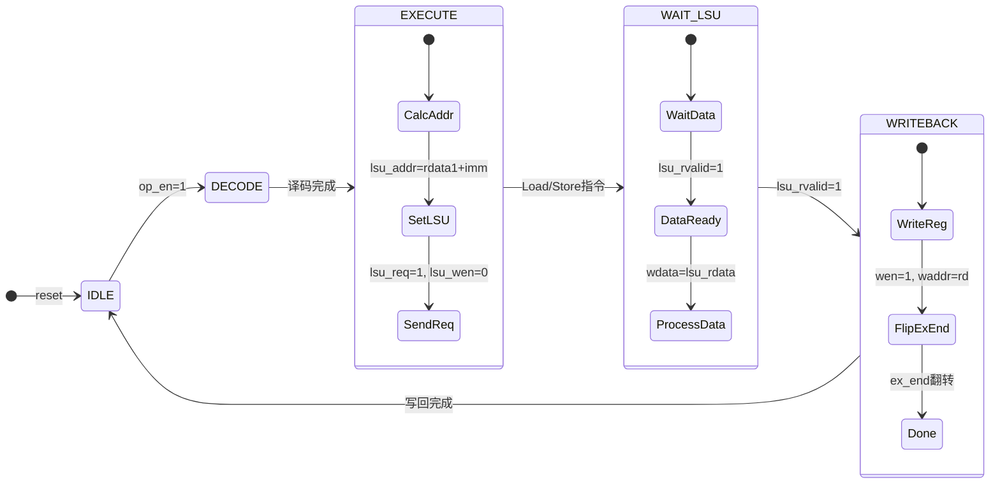
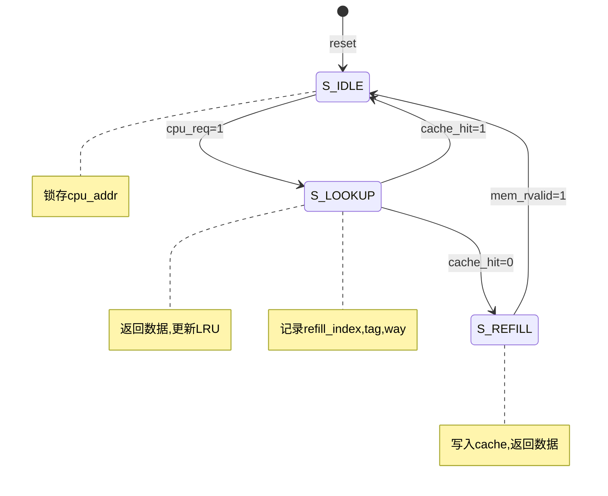
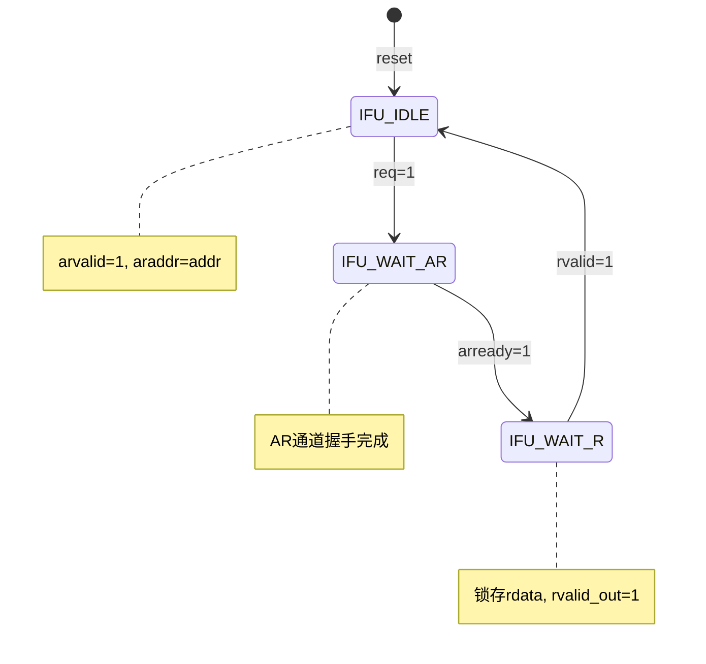
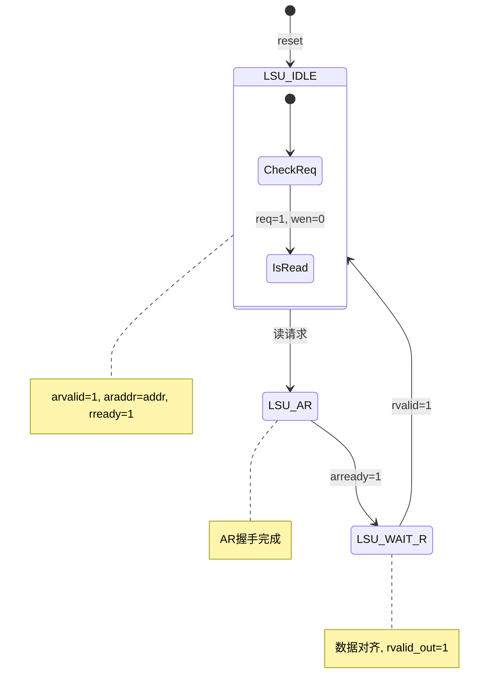
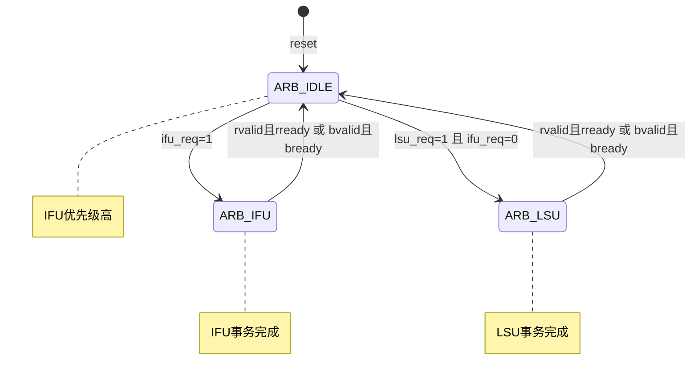
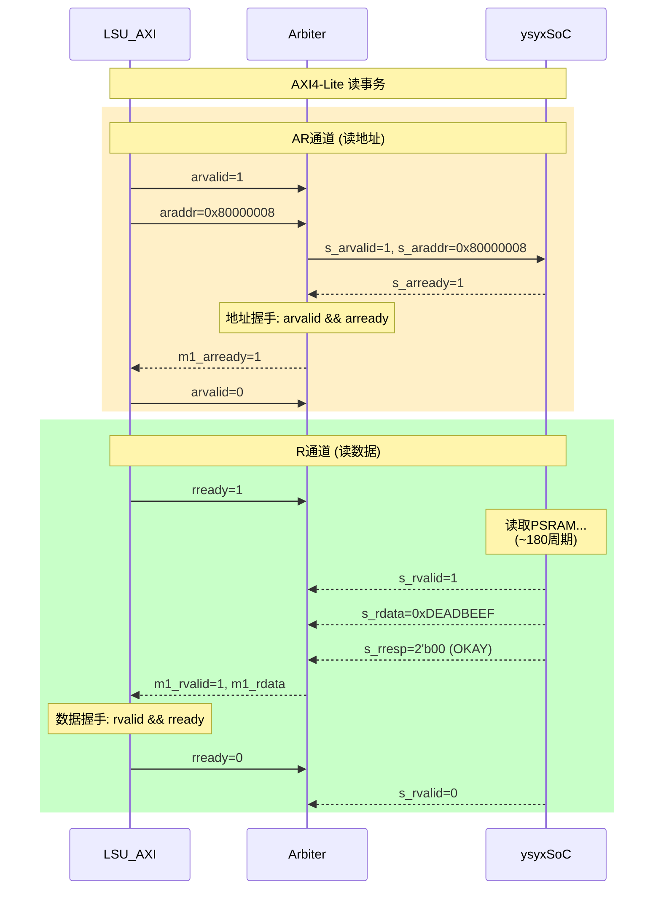

# LW 指令完整执行时序图

> 本文档详细展示 `lw x6, 8(x10)` 指令在 NPC 处理器中从取指到写回的完整执行过程，包括所有模块的状态变化和信号交互。

## 一、指令概述

### 1.1 典型指令

```
lw x6, 8(x10)
```

| 属性 | 值 |
|------|-----|
| 机器码 | `0x00852303` |
| 含义 | `x6 = Memory[x10 + 8]` |
| 类型 | I 型指令（Load） |

### 1.2 指令编码分解

```
0x00852303 = 0000_0000_1000_0101_0010_0011_0000_0011

| imm[11:0]    | rs1   | funct3 | rd    | opcode  |
| 000000001000 | 01010 | 010    | 00110 | 0000011 |
|     8        |  x10  |  LW    |  x6   |  Load   |
```

### 1.3 涉及的模块

| 模块 | 文件 | 功能 |
|------|------|------|
| TopModule | `ysyx_00000000.v` | 顶层控制、PC管理 |
| ICache | `ICache.v` | 指令缓存（可选） |
| IFU_AXI | `IFU_AXI.v` | 取指AXI接口 |
| Arbiter | `AXI4_Lite_Arbiter.v` | 总线仲裁 |
| EXU | `EXU.v` | 执行单元 |
| RegisterFile | `RegisterFile.v` | 寄存器文件 |
| LSU_AXI | `LSU_AXI.v` | 访存AXI接口 |

---

## 二、完整执行时序图

### 2.1 主时序图（ICache 命中场景）



### 2.2 ICache 未命中场景时序图



---

## 三、各模块状态机转换详图

### 3.1 EXU 状态机（LW指令执行路径）



### 3.2 ICache 状态机



### 3.3 IFU_AXI 状态机



### 3.4 LSU_AXI 读操作流程



### 3.5 Arbiter 状态机



---

## 四、逐周期信号变化表

假设：
- ICache 命中（取指 2 周期）
- PSRAM 读延迟约 180 周期
- x10 = 0x80000000

### 4.1 取指阶段（T0-T2）

| 周期 | 模块 | 信号 | 值 | 说明 |
|------|------|------|-----|------|
| T0 | TOP | pc | 0x30000010 | 当前PC |
| T0 | TOP | ifu_req | 0→1 | 发起取指请求 |
| T0 | TOP | ifu_addr | 0x30000010 | 取指地址 |
| T0 | ICache | state | IDLE→LOOKUP | 状态转换 |
| T0 | ICache | req_addr_reg | 0x30000010 | 锁存地址 |
| T1 | ICache | req_tag | 0x060000 | Tag[31:11] |
| T1 | ICache | req_index | 0x004 | Index[10:2] |
| T1 | ICache | hit_way0/1 | 1/0 | 命中way0 |
| T1 | ICache | cache_hit | 1 | 缓存命中 |
| T1 | ICache | cpu_rvalid | 0→1 | 数据有效 |
| T1 | ICache | cpu_rdata | 0x00852303 | 指令数据 |
| T1 | ICache | lru[idx] | 0→1 | 更新LRU |
| T1 | ICache | state | LOOKUP→IDLE | 返回空闲 |
| T2 | TOP | op_ifu | 0x00852303 | 锁存指令 |
| T2 | TOP | op_en_ifu | 0→1 | 指令有效 |

### 4.2 译码阶段（T3）

| 周期 | 模块 | 信号 | 值 | 说明 |
|------|------|------|-----|------|
| T3 | EXU | state | IDLE→DECODE | 进入译码 |
| T3 | EXU | opcode | 7'b0000011 | Load类型 |
| T3 | EXU | funct3 | 3'b010 | LW指令 |
| T3 | EXU | rd | 5'b00110 | 目标: x6 |
| T3 | EXU | rs1 | 5'b01010 | 源: x10 |
| T3 | EXU | imm_i | 12'h008 | 立即数: 8 |
| T3 | EXU | imm_i_sext | 32'h00000008 | 符号扩展 |
| T3 | RF | raddr1 | 10 | 读地址 |
| T3 | RF | rdata1 | 0x80000000 | x10的值 |

### 4.3 执行阶段（T4）

| 周期 | 模块 | 信号 | 值 | 说明 |
|------|------|------|-----|------|
| T4 | EXU | state | DECODE→EXECUTE | 进入执行 |
| T4 | EXU | lsu_addr | 0x80000008 | =rdata1+imm |
| T4 | EXU | lsu_req | 0→1 | LSU请求 |
| T4 | EXU | lsu_wen | 0 | 读操作 |
| T4 | EXU | lsu_wmask | 4'b1111 | 读4字节 |
| T4 | EXU | waddr | 6 | 准备写x6 |
| T4 | EXU | wen | 1 | 准备写回 |
| T4 | EXU | next_pc | 0x30000014 | PC+4 |
| T4 | EXU | state | EXECUTE→WAIT_LSU | 等待LSU |

### 4.4 访存阶段（T5-T185，约180周期）

| 周期 | 模块 | 信号 | 值 | 说明 |
|------|------|------|-----|------|
| T5 | LSU | arvalid | 0→1 | 发起读地址 |
| T5 | LSU | araddr | 0x80000008 | 读地址 |
| T5 | LSU | rready | 0→1 | 准备接收 |
| T5 | ARB | state | IDLE→ARB_LSU | 授权LSU |
| T5 | ARB | s_arvalid | 0→1 | 转发到SoC |
| T5 | ARB | s_araddr | 0x80000008 | 转发地址 |
| T6 | MEM | s_arready | 1 | 地址握手 |
| T6 | LSU | arvalid | 1→0 | 清除请求 |
| T7-T184 | MEM | - | - | PSRAM读延迟 |
| T185 | MEM | s_rvalid | 0→1 | 数据有效 |
| T185 | MEM | s_rdata | 0xDEADBEEF | 读取数据 |
| T185 | ARB | m1_rvalid | 0→1 | 转发给LSU |
| T185 | ARB | m1_rdata | 0xDEADBEEF | 转发数据 |
| T185 | LSU | rready | 1→0 | 接收完成 |
| T185 | LSU | rvalid_out | 0→1 | 输出有效 |
| T185 | LSU | rdata_out | 0xDEADBEEF | 输出数据 |
| T185 | ARB | state | ARB_LSU→IDLE | 释放总线 |

### 4.5 写回阶段（T186）

| 周期 | 模块 | 信号 | 值 | 说明 |
|------|------|------|-----|------|
| T186 | EXU | lsu_rvalid | 1 | 收到LSU数据 |
| T186 | EXU | lsu_rdata | 0xDEADBEEF | LSU数据 |
| T186 | EXU | state | WAIT_LSU→WRITEBACK | 进入写回 |
| T186 | EXU | wdata | 0xDEADBEEF | 准备写数据 |

### 4.6 写回完成（T187）

| 周期 | 模块 | 信号 | 值 | 说明 |
|------|------|------|-----|------|
| T187 | EXU | state | WRITEBACK→IDLE | 返回空闲 |
| T187 | RF | wen | 1 | 写使能 |
| T187 | RF | waddr | 6 | 写地址 |
| T187 | RF | wdata | 0xDEADBEEF | 写数据 |
| T187 | RF | rf[6] | 0xDEADBEEF | x6更新 |
| T187 | EXU | ex_end | ~ex_end | 翻转 |
| T187 | EXU | lsu_req | 1→0 | 清除请求 |

### 4.7 PC更新（T188）

| 周期 | 模块 | 信号 | 值 | 说明 |
|------|------|------|-----|------|
| T188 | TOP | ex_end变化 | 检测到 | 执行完成 |
| T188 | TOP | update_pc | 0→1 | 准备更新PC |
| T188 | TOP | pc | 0x30000014 | 新PC值 |
| T188 | TOP | ifu_req | 0→1 | 发起新取指 |

---

## 五、AXI4-Lite 协议时序详解

### 5.1 LSU 读事务时序



### 5.2 AXI4-Lite 信号定义

| 通道 | 信号 | 方向 | 说明 |
|------|------|------|------|
| AR | arvalid | M→S | 读地址有效 |
| AR | arready | S→M | 读地址就绪 |
| AR | araddr | M→S | 读地址 |
| R | rvalid | S→M | 读数据有效 |
| R | rready | M→S | 读数据就绪 |
| R | rdata | S→M | 读数据 |
| R | rresp | S→M | 读响应 |

---

## 六、关键代码片段

### 6.1 EXU 处理 Load 指令（EXECUTE状态）

```verilog
// EXU.v: EXECUTE状态处理Load指令
7'b0000011: begin  // Load opcode
    lsu_addr <= rdata1 + imm_i_sext;  // 基址 + 偏移
    lsu_req <= 1;                      // 发起LSU请求
    lsu_wen <= 0;                      // 读操作
    waddr <= rd[4:0];                  // 目标寄存器
    wen <= 1;                          // 准备写回
    next_pc <= pc + 4;                 // 默认PC+4
    
    case (funct3)
        3'b000: lsu_wmask <= 4'b0001;  // LB: 1字节
        3'b001: lsu_wmask <= 4'b0011;  // LH: 2字节
        3'b010: lsu_wmask <= 4'b1111;  // LW: 4字节
        3'b100: lsu_wmask <= 4'b0001;  // LBU
        3'b101: lsu_wmask <= 4'b0011;  // LHU
    endcase
    
    state <= WAIT_LSU;  // 转到等待LSU状态
end
```

### 6.2 EXU WAIT_LSU 状态

```verilog
// EXU.v: WAIT_LSU状态
WAIT_LSU: begin
    lsu_req <= 0;  // 清除请求
    
    if (lsu_rvalid) begin
        if (opcode == 7'b0000011) begin  // Load指令
            case (funct3)
                3'b000: wdata <= {{24{lsu_rdata[7]}}, lsu_rdata[7:0]};   // LB
                3'b001: wdata <= {{16{lsu_rdata[15]}}, lsu_rdata[15:0]}; // LH
                3'b010: wdata <= lsu_rdata;                               // LW
                3'b100: wdata <= {24'b0, lsu_rdata[7:0]};                // LBU
                3'b101: wdata <= {16'b0, lsu_rdata[15:0]};               // LHU
            endcase
        end
        state <= WRITEBACK;
    end
end
```

### 6.3 LSU_AXI 读请求

```verilog
// LSU_AXI.v: 发起读请求
if (!awvalid && !wvalid && !bready && !arvalid && !rready && !rvalid_out) begin
    if (req && !in_dmem) begin
        if (!wen) begin  // 读操作
            araddr <= addr;
            arvalid <= 1'b1;
            rready <= 1'b1;
        end
    end
end
```

### 6.4 寄存器文件写入

```verilog
// RegisterFile.v: 写操作
always @(posedge clk) begin
    if (wen && waddr != 0) begin  // x0不可写
        rf[waddr] <= wdata;
    end
end
```

---

## 七、性能分析

### 7.1 周期统计

| 阶段 | 周期数 | 占比 |
|------|--------|------|
| 取指（ICache命中） | 2 | 1.1% |
| 译码 | 1 | 0.5% |
| 执行 | 1 | 0.5% |
| 访存（PSRAM） | ~180 | 96.8% |
| 写回 | 1 | 0.5% |
| PC更新 | 1 | 0.5% |
| **总计** | **~186** | 100% |

### 7.2 性能瓶颈

LW 指令的主要延迟来自 **访存阶段**，占总执行时间的 96.8%：

1. **PSRAM 延迟**：约 180 周期（通过 APB 总线访问）
2. **AXI 协议开销**：地址握手 1-2 周期

### 7.3 优化方向

| 优化方案 | 预期效果 |
|----------|----------|
| 添加 D-Cache | 减少重复访存延迟 |
| 使用 SRAM 而非 PSRAM | 将延迟从 180 降至 1-2 周期 |
| 流水线化 | 允许多指令并行 |

---

## 八、总结

LW 指令的执行经过以下完整路径：

```
PC → ICache → IFU_AXI → Arbiter → Memory
                ↓
            TopModule
                ↓
        EXU (DECODE → EXECUTE → WAIT_LSU → WRITEBACK)
                ↓
    RegisterFile ← LSU_AXI ← Arbiter ← Memory
                ↓
            PC更新
```

这条指令涉及了 NPC 处理器中几乎所有的核心模块，是理解处理器数据通路的最佳示例。
